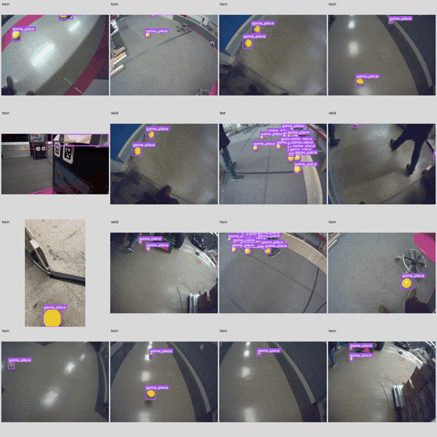
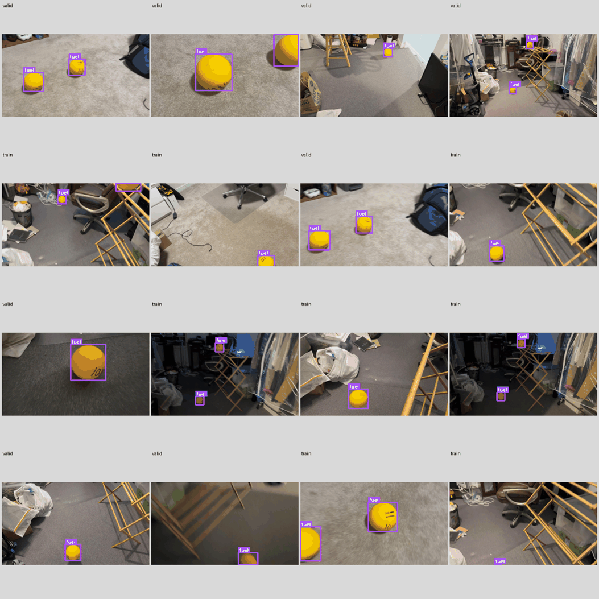
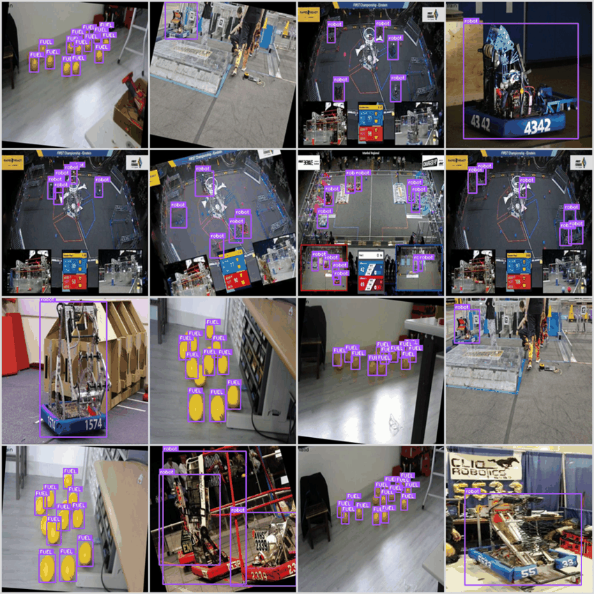
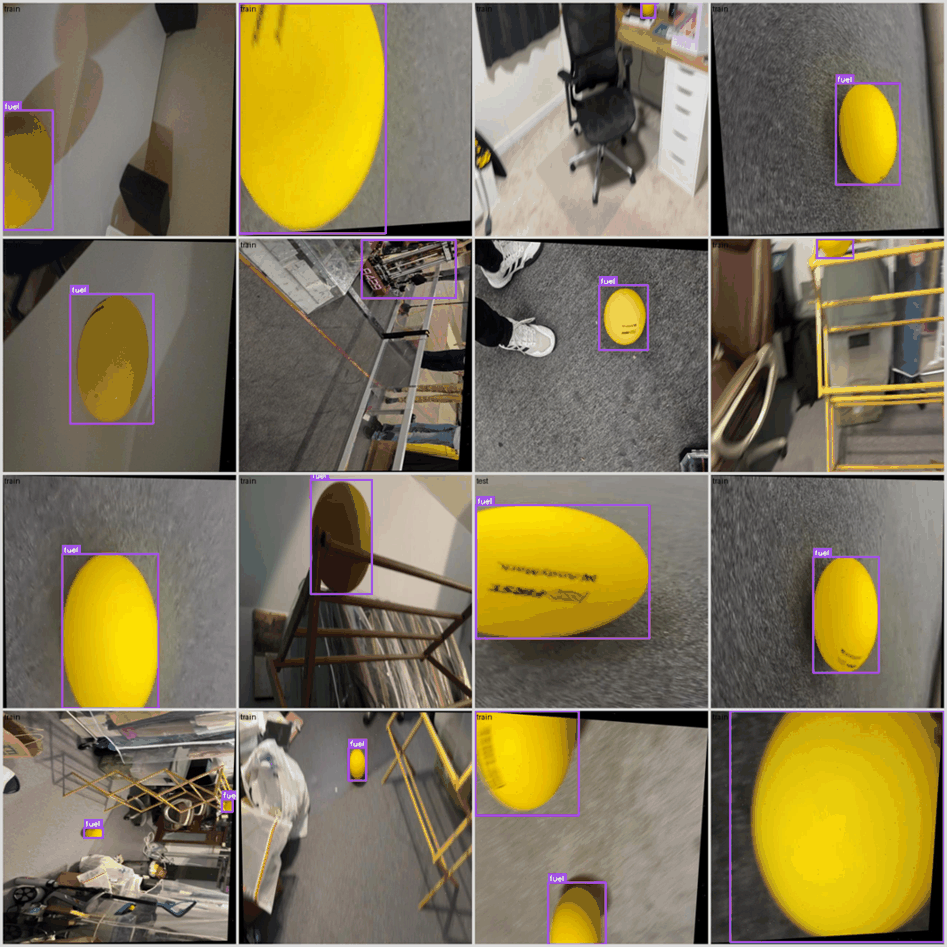
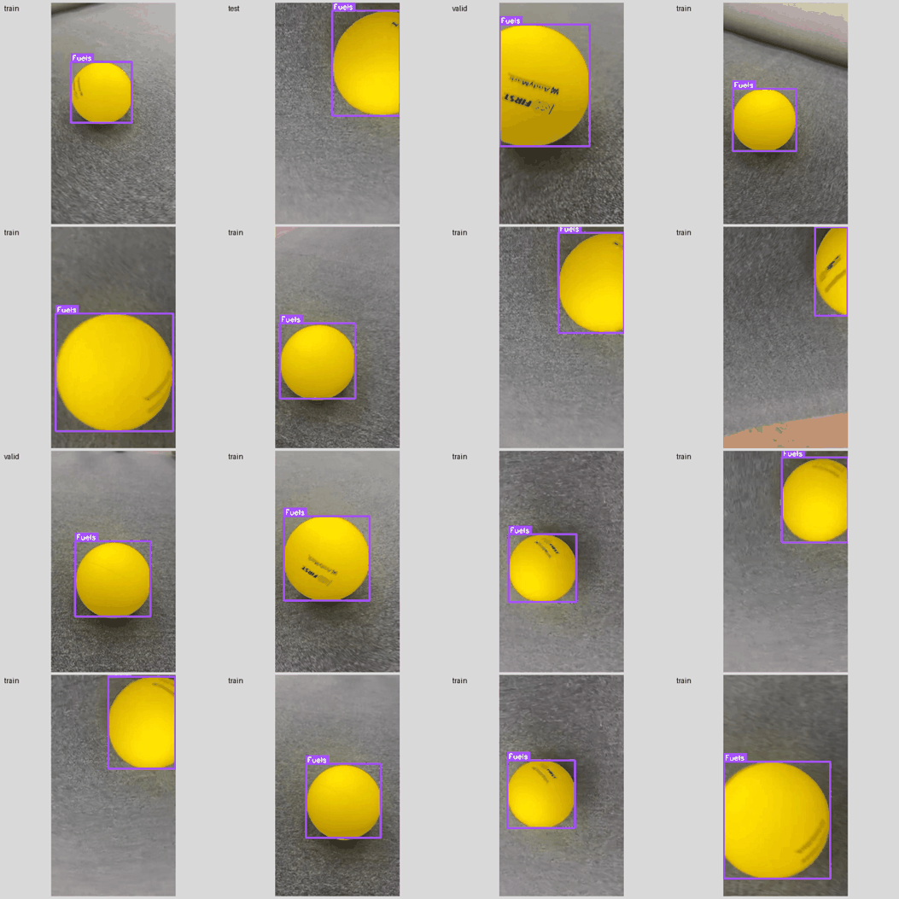

# Datasets

The five REBUILT datasets the pipeline downloads from Roboflow Universe, how
each one is labeled, and what is wrong with each. Counts come from
`reports/dataset_stats.csv`, `reports/class_counts.csv`,
`reports/duplicates.json`, and `reports/dataset_resolution.json`, which `make
inspect` and `make download ARGS=--resolve` regenerate. Versions are pinned in
`configs/datasets.yaml` and attributed in the README.

## Recommendation

This is a proposal for review. It becomes a decision in `docs/DECISIONS.md`
once it is approved.

Dataset A, the baseline, is `marswars`. It is the only dataset shot from a
camera mounted on a robot, which is where our detector will run. None of its
images are augmented copies, and it shares no images with any other dataset,
so its test split is clean for cross-dataset comparison. It labels fuel only.

Dataset B is `robotzftp2`. It shows fuel on carpet in a cluttered home, filmed
from a handheld phone at standing height, which differs from A in viewpoint,
venue, lighting, and resolution. It has no augmented copies. It labels fuel
only.

Dataset C is `scorekeeper`, cut down to one image per source photo. It is one
of only two datasets that label robots, and its fuel sits in tight tabletop
clusters, a label style neither A nor B has. It needs the most cleanup of the
three, and its robots come from earlier FRC seasons (see below).

`testingfrfr` and `robotzftp2_fuel` are left out of evaluation. `testingfrfr`
overlaps heavily with B and C, so scoring on it would measure memory instead
of generalization. `robotzftp2_fuel` holds one large, centered ball per image,
which is too easy to tell us anything. `testingfrfr` may still be useful as
extra training data for the merged model, after removing every image that
matches a test image.

The main trade-off is the robot class. With `marswars` as A, the baseline
never sees a robot, so robot results start with the merged model, and only on
robots from past games. The alternative is to make `scorekeeper` Dataset A,
which adds robots to the baseline but builds it on augmented, leaky data whose
robots are not REBUILT robots. We recommend `marswars`, because the fuel
detector on the robot camera is the use case and the dataset with the cleanest
test split should anchor the comparison.

## Terms

An augmented copy is an image Roboflow generated from a source photo by
flipping, rotating, or changing its exposure. A version with augmentation
holds up to three copies of each training photo, so its image count overstates
how much distinct data it has. A near duplicate is a pair of images whose
perceptual hashes differ in at most 4 bits (D-010). In practice these are the
same photo or adjacent frames from one video. A leak is a near duplicate that
ends up on both sides of a train and test split, which makes test scores look
better than they would on new footage.

## marswars

`marswars-robotics-program/2026-rebuilt`, version 5, exported as "Roboflow
Instant 4 [Eval]". 979 train, 199 valid, and 132 test images, with no
augmentation.

Most images come from a Basler camera mounted low on a robot, with a fisheye
lens, all recorded on 2026-01-12 according to the file names. The scenes are a
school shop and hallway with fluorescent light and glare on polished floors, a
wooden practice-field border, and people's legs at the edge of the frame. A
smaller group of frames comes from FIRST's official 2026 game videos, which
show the real field under arena lighting with over a hundred balls on the
carpet (up to 179 boxes in one image).

Fuel is labeled `game_piece`, with tight boxes around each ball, including
balls touching each other in clusters and balls partly cut off by the image
edge. The box-area buckets in the stats CSV show most boxes are small or
medium. In the sample we checked, zero-label images (85 train, 16 valid, 20
test) are empty floor and hallway shots with no fuel.

Three more classes, `blue_active`, `red_active`, and `inactive`, appear only
in the official-video frames. They mark the hub and its lit top panel, and the
name records whether the hub is lit blue, lit red, or dark. They describe
field state rather than an object to detect, so we propose mapping them to
DROP. They are rare (35, 22, and 37 train instances).

The export name suggests the version was labeled with help from Roboflow's
Instant model, so some boxes may be model output that was reviewed rather than
drawn by hand. We saw no wrong boxes in the sample. The kitbot in the
official-video frames is not labeled, which does not matter because `marswars`
is never scored on robots.

Adjacent frames of the same run fall in different splits (289 near-duplicate
pairs between test and train, 428 between train and valid), so splits have to
group images by recording. There are no near duplicates with any other
dataset.

## robotzftp2

`robot-zftp2/rebuilt-dataset-hcmwl`, version 1. 1272 train and 626 valid
images at 1920 by 1080, with no test split and no augmentation.

Handheld phone video of one to three balls on carpet in a home, among office
chairs, a drying rack, bags, and cables, under warm indoor light with motion
blur in some frames. The camera is at standing height and looks down at a
steep angle.

Fuel is labeled `fuel` with tight boxes, including balls cut off by the image
edge and balls partly behind the drying rack. The zero-label images (54 train,
22 valid) we checked show no fuel.

There is no test split, so the pipeline has to make one. Frames of one video
sit in both splits (815 near-duplicate pairs between train and valid), so the
split has to be by video. It overlaps heavily with `testingfrfr` (3374
near-duplicate pairs with its train split alone).

## scorekeeper

`blind-assistant-model/frc-scorekeeper-2026`, version 1, named "trial1".
Stretched to 512 by 512, with three augmented copies of each training image
(random rotation and exposure). The train split holds 4449 images made from
1336 source photos. Valid holds 450 images from 429 sources and test 183 from
176.

Two kinds of images are mixed together. Fuel appears in phone photos of balls
laid out on a floor or table indoors, often in groups of about fifteen. Robots
appear in pit photos and in match broadcasts, many from a 2024 FIM District
match at Milford, 2022 Rapid React matches on Einstein, and 2023 Charged Up
events. None of the file names point to a REBUILT robot.

Fuel is labeled `FUEL` and robots `robot`. Boxes are tight on the source
photos. On rotated copies, the boxes are the axis-aligned hull of the rotated
box, so they are looser, and a ball at the edge of a cluster sometimes has no
box. Robot boxes cover the whole robot, bumpers included. Broadcast frames
also label the robots in the picture-in-picture insets.

Zero-label images are mostly score screens, crowd shots, and a 2016 field. At
least one is a 2023 broadcast frame with robots in view and no labels, which
is a missed label.

The same source photo appears in more than one split (87 source names, see
`source_name_overlap`), and near duplicates between test and train number 1642
pairs. Test scores on this version as exported would be inflated. It overlaps
heavily with `testingfrfr` (15288 near-duplicate pairs between the two train
splits). Some frames show spectators' faces, which the sample grid excludes
(D-010).

## testingfrfr

`testing-frfr/frc-2026-mldc0`, version 1. Stretched to 640 by 640, with three
augmented copies of each training image (flips, 90 degree rotations, and
shear). The train split holds 12015 images made from 3632 source photos. Valid
holds 698 images from 689 sources and test 252 from 235.

This is an aggregate. Its fuel images are the same home footage as
`robotzftp2` and `robotzftp2_fuel` plus close-ups, and its robots come from
broadcasts of the 2019, 2020, 2022, 2023, and 2024 seasons, including the same
Milford match as `scorekeeper`. The 90 degree rotations and flips put
broadcast frames on their side or upside down.

Fuel is labeled `fuel` and robots `robot`. Fuel boxes are tight. Robot boxes
cover whole robots, including small ones in broadcast insets.

It shares near duplicates with three other datasets: 15288 pairs between its
train split and `scorekeeper` train, 2049 between its train split and
`scorekeeper` test, 3374 with `robotzftp2` train, and 845 with
`robotzftp2_fuel` train. Inside it, 4 exact duplicates cross test and train
and 4 cross train and valid, and near duplicates between test and train number
3420. Another 121 source names appear in more than one split.

## robotzftp2_fuel

`robot-zftp2/frc-2026-fuel-ndrbj`, version 1. 320 train, 96 valid, and 48 test
images, in portrait at 540 by 960 or 360 by 640, with no augmentation.

Phone close-ups of a single ball on carpet, filmed from two videos. Every
image has exactly one box except one test image with two, and every box is in
the large bucket. The label is `Fuels`.

The task is close to trivial, so a detector that fails elsewhere would still
score well here. Frames of the two videos cross splits (61 near-duplicate
pairs between test and train), and it overlaps heavily with `testingfrfr` (845
near-duplicate pairs with its train split).

## lava

`lava/frc-2026-aagvs` has 442 images labeled with three spellings of fuel
(`2026-FRC-Fuel-V2`, `Fuel`, and `fuel`), but no published version. Roboflow
only exports versions, so it was not downloaded (D-008).

## Leakage across datasets

`marswars` shares no near duplicates with any other dataset. Every overlap
among the other four involves `testingfrfr`. `scorekeeper`, `robotzftp2`, and
`robotzftp2_fuel` do not overlap with each other directly. The full counts are
under `near.counts.cross_dataset` in `reports/duplicates.json`.

For the proposed A, B, and C, this means the three test sets are independent
of each other, and `testingfrfr` must never be merged into training without
removing its matches to every test split first. The field test set, once it
exists, goes through the same check (SPEC section 8).

## Proposed class mapping

`configs/class_map.yaml` will implement this mapping.

| Dataset | Source label | Maps to |
|---|---|---|
| marswars | `game_piece` | fuel |
| marswars | `blue_active`, `red_active`, `inactive` | DROP |
| robotzftp2 | `fuel` | fuel |
| scorekeeper | `FUEL` | fuel |
| scorekeeper | `robot` | robot |
| testingfrfr | `fuel` | fuel |
| testingfrfr | `robot` | robot |
| robotzftp2_fuel | `Fuels` | fuel |

Roboflow adds an empty placeholder category at id 0 to every COCO file, and
the pipeline ignores it.

Evaluation is per class, and a dataset is only scored on the classes it
labels. `marswars` and `robotzftp2` are scored on fuel only, and `scorekeeper`
on both.

## Splits

Because adjacent frames cross splits in every dataset, splits have to group
images by source video or photo and not by image. For the augmented versions,
every augmented copy has to follow its source photo into the same split, and
test and valid should hold one copy per source. The source name before `.rf.`
in each file name identifies the photo, and the part before the frame number
identifies the video.

## Limits

Label-style notes come from looking at the sample grids and at contact sheets
of the densest and zero-label images of each dataset. That is a sample, and we
did not audit every box. Near-duplicate counts depend on the pHash threshold,
and at 4 bits they include adjacent video frames as well as copies of one
photo (D-010). Source-video and season notes come from file names, and some
file names (such as `youtube-40.jpg`) do not say which event they are from.
