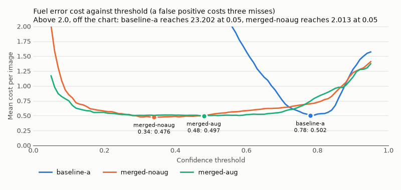

# Evaluation

This page explains how models are scored, lists every published result,
and diagnoses where the errors come from. Everything between the
`EVALUATION` markers and between the `DIAGNOSIS` markers is written by
`make report` from `reports/runs/` and `reports/diagnosis/`. Do not edit
it by hand.

## What the merged data fixed, and what it broke

`merged-noaug` is the same RF-DETR Nano as baseline-a, trained on fuel and
robots from A, B, C, and `testingfrfr` together (D-028), with no
augmentation. `merged-aug` continued from it on an augmented copy of the
same data (D-029). Both are scored on the same test splits as baseline-a,
plus the lockbox, `pankratz`, which no model trained on (D-026). baseline-a
is rescored from its cached predictions under the same rules, so every
number in this section compares like with like. Fuel labels touching the
frame edge are set aside in all of them (D-027).

On C, the fix works. baseline-a drew 1083 fuel boxes that matched no
label, and `merged-noaug` draws 69. Precision rises from 0.257 to 0.844,
and every labeled fuel box is still found (recall 1.0). mAP50 moves from
0.836 to 0.886, but the intervals overlap (0.773 to 0.895 against 0.87 to
0.928), so precision, not mAP50, is where the change shows. None of the 69
false positives is on a pit photo or a match broadcast, where baseline-a
had 632 on the Milford broadcast alone. All of them fall on the 31 photos
of fuel on floors and tables, 2.226 per image. Of the 69, 59 overlap a
labeled ball without matching it closely enough, a loose or offset box,
and 10 touch no label. Those 10 may include some of the unlabeled balls
in these photos' clusters (D-021).

Robots are scored for the first time, on C only, since no other test
split labels them. `merged-noaug` finds 846 of the 1007 robot boxes
(recall 0.84, mAP50 0.894) and draws 94 robot boxes that match no label.
These robots come from earlier seasons (D-011), so this says nothing yet
about REBUILT robots.

On the lockbox, the merged model is worse than the baseline, and by more
than the resampling spread. baseline-a scores fuel mAP50 0.956 (interval
0.931 to 0.975) with recall 0.948. `merged-noaug` scores 0.813 (0.747 to
0.875) with recall 0.486, so it misses about half the balls, though it
almost never draws one where there is none (precision 0.985, 5 false
positives). The misses are nearly all on one kind of image. On the 314
webcam frames, which show one person holding and tossing balls close to
the camera, recall is 0.393, and they hold 472 of the 473 misses. On the
phone photos recall is 1.0, and on the phone video 0.972. By box size, the
model finds 24 of the 270 small balls (recall 0.089). The diagnosis does
not cross box size with the kind of image, so it cannot say whether the
model misses these balls because they are small, because they are near a
person, or both. Part of the drop is confidence rather than balls the
model never sees. At a threshold of 0.05, `merged-noaug`'s recall is 0.808
with precision 0.658, against baseline-a's 0.971 with precision 0.282, so
many of the missed balls get a box with a low score. Choosing the
threshold is Task 11. One reading worth testing is that the negatives that
stopped the false positives on C also taught the model to score fuel next
to a person low.

On A and B the three models are close. `merged-noaug` scores fuel mAP50
0.979 on A and 1.0 on B, and baseline-a 0.967 and 1.0, with overlapping
intervals. B is no longer a held-out domain, since the merged models
trained on B's train split, and A-test was always later frames of A's
training recordings (D-013).

`merged-aug` differs little from `merged-noaug`. On C its fuel mAP50 is
0.891 and precision 0.842, on the lockbox mAP50 0.754 and recall 0.537, and
on A 0.956. It had 31 more epochs of training as well as augmentation
(D-029), so these runs cannot show what augmentation alone does.

The fix did what the diagnosis asked on C, and the lockbox shows its cost.
A robot-mounted detector would meet people and fuel in the same frame,
which is the case the lockbox covers, so neither merged model is ready to
replace baseline-a for that use. The next step is training data where
people hold or stand near fuel, labeled, so the negatives stop teaching
the model that fuel near a person is background.

These results have limits. The lockbox is 363 images from one workshop,
most of them webcam frames of one person, and it was picked after the
diagnosis (D-026). The merged models' errors were sliced but not judged by
eye (D-030), so their false positives on C's fuel photos are not sorted
into real fuel and mistakes. The field test set has not been scored.

## Choosing the robot's threshold

<!-- THRESHOLD:START -->
Costs price one fuel false positive at 3.0 and one miss at 1.0, per image of each set. The chosen threshold has the lowest mean cost over the tuning sets, and the band is the run of thresholds around it within 0.05 of that cost as a share. Only the held-out half of the lockbox played no part in the choice. <!-- numbers: ok -->

| Model | Chosen threshold | Band | Mean cost | Mean cost at 0.5 | Held-out recall interval |
|---|---|---|---|---|---|
| baseline-a | 0.78 | 0.77 to 0.8 | 0.502 | 2.845 | 0.763 to 0.905 |
| merged-noaug | 0.34 | 0.29 to 0.47 | 0.476 | 0.519 | 0.429 to 0.765 |
| merged-aug | 0.48 | 0.25 to 0.61 | 0.497 | 0.503 | 0.371 to 0.726 |



#### baseline-a at 0.78 and at 0.5

| Set | Role | Images | Precision | Recall | False positives | Misses | Cost | Precision at 0.5 | Recall at 0.5 | Cost at 0.5 |
|---|---|---|---|---|---|---|---|---|---|---|
| marswars test | tuning | 171 | 0.993 | 0.927 | 2 | 24 | 0.175 | 0.976 | 0.976 | 0.187 |
| robotzftp2 test | tuning | 286 | 1.0 | 1.0 | 0 | 0 | 0.0 | 0.959 | 1.0 | 0.126 |
| scorekeeper test | tuning | 314 | 0.711 | 0.995 | 151 | 2 | 1.449 | 0.257 | 1.0 | 10.347 |
| pankratz tuning half | tuning | 165 | 1.0 | 0.833 | 0 | 63 | 0.382 | 0.92 | 0.942 | 0.721 |
| pankratz held-out half | held out | 198 | 0.994 | 0.839 | 3 | 88 | 0.49 | 0.958 | 0.953 | 0.48 |

#### merged-noaug at 0.34 and at 0.5

| Set | Role | Images | Precision | Recall | False positives | Misses | Cost | Precision at 0.5 | Recall at 0.5 | Cost at 0.5 |
|---|---|---|---|---|---|---|---|---|---|---|
| marswars test | tuning | 171 | 0.985 | 0.97 | 5 | 10 | 0.146 | 0.991 | 0.963 | 0.123 |
| robotzftp2 test | tuning | 286 | 0.993 | 1.0 | 2 | 0 | 0.021 | 0.996 | 1.0 | 0.01 |
| scorekeeper test | tuning | 314 | 0.842 | 1.0 | 70 | 0 | 0.669 | 0.844 | 1.0 | 0.659 |
| scorekeeper test (robot) | tuning | 314 | 0.863 | 0.877 | 140 | 124 | n/a | 0.9 | 0.84 | n/a |
| pankratz tuning half | tuning | 165 | 0.986 | 0.557 | 3 | 167 | 1.067 | 1.0 | 0.438 | 1.285 |
| pankratz held-out half | held out | 198 | 0.962 | 0.6 | 13 | 219 | 1.303 | 0.976 | 0.52 | 1.394 |

#### merged-aug at 0.48 and at 0.5

| Set | Role | Images | Precision | Recall | False positives | Misses | Cost | Precision at 0.5 | Recall at 0.5 | Cost at 0.5 |
|---|---|---|---|---|---|---|---|---|---|---|
| marswars test | tuning | 171 | 0.984 | 0.951 | 5 | 16 | 0.181 | 0.984 | 0.948 | 0.187 |
| robotzftp2 test | tuning | 286 | 0.996 | 1.0 | 1 | 0 | 0.01 | 1.0 | 1.0 | 0.0 |
| scorekeeper test | tuning | 314 | 0.842 | 1.0 | 70 | 0 | 0.669 | 0.842 | 1.0 | 0.669 |
| scorekeeper test (robot) | tuning | 314 | 0.901 | 0.854 | 94 | 147 | n/a | 0.906 | 0.853 | n/a |
| pankratz tuning half | tuning | 165 | 0.981 | 0.538 | 4 | 174 | 1.127 | 0.98 | 0.525 | 1.158 |
| pankratz held-out half | held out | 198 | 0.984 | 0.553 | 5 | 245 | 1.313 | 0.984 | 0.546 | 1.333 |
<!-- THRESHOLD:END -->

## How the baseline does on other teams' data

This section and the next describe baseline-a's v0.1.0 runs, scored
before the edge rule (D-027). The tables under "Results" show its
rescores, which set labels at the frame edge aside.

baseline-a was trained on fuel from `marswars` (Dataset A) and scored on
the test splits of A, `robotzftp2` (B), and `scorekeeper` (C). The terms
are explained under "Reading the numbers" below.

On A, its own dataset, fuel mAP50 is 0.936 (interval 0.923 to 1.0), with
precision 0.963 and recall 0.927 at a confidence of 0.5.

On B, the model does as well as on A. Fuel mAP50 is 0.994 (interval 0.985
to 1.0), with precision 0.966 and recall 0.973. The next section explains
why.

On C, fuel mAP50 drops to 0.836 (interval 0.773 to 0.895). That interval
does not overlap A's, so the drop is larger than what the choice of test
photos alone would explain. Every labeled fuel box is found (375 hits,
recall 1.0), so the whole drop comes from false positives. The model also
draws 1083 boxes that match no label, which puts precision at 0.257.
Raising the threshold helps only partway. At 0.8, precision is 0.724 and
recall 0.981.

C's numbers are bounds. Most of C's images reached the limit of 25 kept
predictions per image (D-020, and the note under C's table), and on a few
of them every kept box is at or above 0.5. Since recall stays at 1.0 even at the
lowest threshold, the limit dropped only false positives. The true mAP50 is
therefore at most 0.836, and the true false positive count at 0.5 is at
least 1083. The drop is at least as large as shown.

C's test split mixes two kinds of photos (see `docs/DATASETS.md`). One kind
shows fuel indoors. The other shows robots in pits and match broadcasts
from earlier games, and none of those photos has a fuel label. Almost all
of the false positives land on the second kind, and most of the sampled
ones are drawn on people, as the next section shows.

These results have limits. A-test holds later frames of the recordings the
model trained on (D-013), so A's score is an optimistic reference point.
A and B each rest on a handful of recordings, which the intervals account
for. C is scored on fuel only, since baseline-a never learned robots
(D-019). Each image keeps its 25 most confident predictions (D-020). The
field test set has not been scored.

## Why the baseline fails where it does

`make diagnose MODEL=baseline-a` matched every cached prediction of the
three runs to the labels again and sliced the hits, false positives, and
misses by source, box size, crowding, brightness, and sharpness. It reuses
the cached predictions and reproduces each run's published counts (D-021).
The tables are under "Diagnosis" at the end of this page.
Errors were also judged by eye (D-021): every false positive and miss on A
and B, and a random 40 of C's false positives. The verdicts and a note on
each are in `reports/diagnosis/baseline-a/review.csv`.

### C's false positives come from photos without fuel


Of C's 1083 false positives, 1012 fall on the 283 test images that have no
fuel label, which is 3.576 per image. These are the pit photos and match
broadcasts. The 2024 Milford broadcast alone gives 632 of them. On the 31
photos that do show fuel, the model finds every ball (recall 1.0),
precision is 0.841, and mAP50 is 0.889. That is below A's 0.936 and its
interval, so C's fuel photos are harder for the model too. All of C scores
0.836, so the photos without fuel account for the rest of the mAP50 drop
and for nearly all of the false positives.

Of the 40 sampled false positives on C, 30 are people: heads in the front
row of a broadcast, spectators in yellow or orange shirts, a yellow hat,
and a mascot. Seven are yellow, orange, and blue balls from earlier games.
The other 3 are real fuel. In a broadcast frame a head is a round blob
about the size of a ball, and a yellow shirt or hat has the color of fuel.
The labels are right, so these are model errors.

The 3 real fuel balls point to a labeling gap in C. All 3 sit in a cluster
with no box of their own, two of them half hidden behind another ball.
Of the 71 false positives on C's fuel photos, 60 overlap a label without
matching it (duplicates and localization errors in the table of false
positive kinds), so C's clusters may be labeled less completely than A's.
If so, C's score on its fuel photos is a little too low. Three sampled
boxes are too few to say how often this happens.

The per-image limit (D-020) can hide false positives on only 4 images, too
few to change which sources lead.

### B is easy because its balls are large and few


B's balls fill much more of the frame than A's. The median box side is
0.148 of the image side in B-test, against 0.044 in A's training split and
0.051 in A-test. B-test also has one ball per image at the median, and two
at the 90th percentile, where A's training split has 17. Large, isolated
balls are an easy case, so B scoring as well as A says little about how
close the two domains are.

B-test has only 13 small boxes, too few to rely on, and the model finds 7
of them (recall 0.538), against A's 0.865.
Of B's 13 false positives, 12 are other yellow objects in the room, such as
the cap of a vacuum cleaner and an envelope. All 10 of its misses are balls
cut off by the edge of the frame, in two recordings, and 9 of them fall in
the darkest brightness bin. That is why recall is 0.91 in B's darkest
images and 1.0 in its brightest.

### A's misses are mostly balls cut off by the frame edge

On A, recall is 0.865 on small boxes and 0.987 on medium ones. Images with
5 to 9 labeled balls have the lowest recall (0.765), but only 7 images
fall there. Almost all of A's misses (32 of 33) come from one recording,
the densest one.

The review explains the small-box gap. Of the 33 misses, 24 are balls cut
off by the edge of the fisheye frame. Their labels are thin strips, which
count as small boxes, and the model boxes them differently or not at all.
Another 4 are balls mostly hidden by a hand or an arm. None is a clearly
visible ball that the model skipped, so nothing here shows that shrinking
the frames to 384 pixels (D-016) loses whole balls. Half of A's 16 false
positives are the same kind. Eight are boxes on edge balls, 7 of which
overlap a label but not enough to count. Five are wrong boxes on labeled
fuel, 3 of them one box over two touching balls. The last 3 are an
unlabeled ball, a loose label, and a box on a person's head.

### What this means for the fix

The largest error on other teams' data is the model drawing fuel on people
and on balls from earlier games. The merged model in Task 10 needs images
of people, crowds, and other games' balls with no fuel label, which C's
pit and broadcast photos provide. The per-source slices here will show
whether that worked. Balls cut off by the frame edge cause most of A's
errors and all of B's misses, because labels and model disagree on how
much of such a ball to box. A rule for labeling edge balls belongs in the
harmonized data. C's unlabeled clustered fuel should be fixed or left out
before C's fuel photos are used for training.

### Limits of the diagnosis

Slices have no intervals, and many rest on few images or on one
recording. Brightness and sharpness are cut into bins pooled over all
three test splits, so on C they mostly separate the fuel photos, which are
soft, from the sharp broadcast frames, and on B they follow the
recordings. They say little on their own. The verdicts are one reviewer's
first pass, and C's rest on 40 of 1083 false positives, so they show which
kinds of error occur, not how often. A lockbox dataset for
checking the fix was not picked before this diagnosis (D-022). The failure
gallery leaves out the Milford broadcast, since every frame of it shows
spectators close to the camera.


The gallery shows 15 of the errors, with labels in green, false positives
in orange, and missed labels in light blue. The tiles are listed under
"Diagnosis" at the end of this page.

## Reading the numbers

A detector draws boxes and gives each one a confidence between 0 and 1,
which is how sure the model is that the box holds an object of that class.
A predicted box counts as a hit when it overlaps a labeled box of the same
class enough. Overlap is measured as intersection over union (IoU), which
is the area the two boxes share divided by the area they cover together.
Each labeled box can be matched by one prediction at most.

- Precision is the share of predicted boxes that are hits. Low precision
  means the model sees fuel that isn't there.
- Recall is the share of labeled boxes that a prediction found. Low recall
  means the model misses fuel.
- mAP50 (mean average precision at IoU 0.5) sorts the predictions by
  confidence and measures how precise the model stays as it finds more of
  the labeled boxes. It is 1 when every labeled box is found before any
  false positive. It uses each image's 25 most confident predictions of
  each class down to a confidence of 0.01.
- mAP50-95 averages the same score over stricter overlap requirements, from
  IoU 0.5 up to 0.95, so it also rewards boxes that sit tightly on the
  object.

Precision and recall depend on the confidence threshold. Raising it drops
unsure predictions, which usually raises precision and lowers recall. The
tables give both at one threshold, and a sweep over thresholds for each
class. A score shown as n/a is undefined. Precision is undefined when the
model predicted nothing of that class, and the other scores are undefined
when the split has no labeled box of that class.

Every test split is small and comes from a few recordings, and frames from
one recording look alike. The intervals next to mAP50 and recall show how
much a score moves when whole recordings (or, for scorekeeper, groups of
related photos) are resampled with replacement. A wide interval means the
score depends heavily on which recordings happen to be in the test split.

A dataset is scored only on the classes it labels, as recorded in
`reports/class_coverage.json`, and only on those the model's training data
labels too (D-019). A robot prediction on a fuel-only dataset is neither a
hit nor a false positive. A fuel-only model is not scored on robot boxes,
and the run's section says which classes were left out.

Runs that record an edge rule also leave out fuel labels that touch the
edge of the frame, since labels and model disagree on how much of a cut-off
ball to box (D-027). Such a ball is neither a hit nor a miss, and a
prediction that mostly overlaps it is dropped unless it hits another label.
The run's section gives both counts. The v0.1.0 runs were scored without
this rule.

## Making a run

Scoring a hosted model needs the `inference` extra and a Roboflow API key in
`.env`:

```bash
make setup-infer
make eval MODEL=baseline-a DATASET=marswars                  # test split
make eval MODEL=baseline-a DATASET=marswars ARGS="--limit 10" # quick check
make report
```

Each run writes `reports/runs/<run_id>/` with three files.
`predictions.json` holds the 25 most confident boxes per image and class
down to the confidence floor in `configs/project.yaml` (D-020, D-025), for
the classes the run scores, rounded as described in D-018. The run is
scored from those rounded values, so
`--from-cache <run_id>` reproduces its scores exactly without calling the
model again, and can rescore them at another threshold. A rescore must name the same model, dataset, and split as the run
it reads. `metrics.json` holds the scores, and `meta.json` records the
commit and tree, config and data hashes, the model entry from
`reports/models.yaml`, the backend the server reported, and package
versions.

A run refuses to start when the repo has uncommitted changes, unless
`--allow-dirty` is passed. The report leaves out those runs, rescores of
them, and runs on only part of a split.

## Limits

The model runs on Roboflow's hosted service, which reported a TensorRT
fp16 backend, so scores can differ slightly from those on the model's page
in the Roboflow app. The service applies the dataset version's own 384x384
resize before running the model, and boxes are scored in the original
image's pixels.

Box sizes follow COCO, which calls a box small when its area is under 32x32
pixels and large when it is over 96x96. They are measured on the original
image. The datasets have different resolutions, so size results are not
comparable between datasets, or with the Roboflow app, which measures sizes
on the resized image.

Precision and recall come from supervision, which matches a prediction to a
box of the same class with IoU of at least 0.5. The hit, false positive, and
miss counts come from the confusion matrix, which matches boxes by overlap
alone and needs IoU above 0.5. In the confusion matrix, a box with the wrong
class counts as a mix-up between two classes. In precision and recall, it
counts as a false positive for one class and a miss for the other. With one
scored class the two agree except for a box at exactly 0.5.

The field test set has not been scored yet.

## Results

<!-- EVALUATION:START -->
### baseline-a on marswars test

Run `baseline-a__marswars-test__20260930T070455Z`, scored on 171 images. Precision, recall, and the confusion matrix count predictions with confidence of at least 0.5.
Intervals come from 1000 resamples of the split's 6 recordings or groups, and hold the middle 95% of the resampled scores. <!-- numbers: ok -->

| Class | Labeled boxes | mAP50 | mAP50 interval | mAP50-95 | Precision | Recall | Recall interval | Hits | False positives | Misses |
|---|---|---|---|---|---|---|---|---|---|---|
| fuel | 328 | 0.967 | 0.956 to 1.0 | 0.683 | 0.976 | 0.976 | 0.966 to 1.0 | 320 | 8 | 8 |

35 of 171 images reached the limit of 25 predictions per image and class (D-020, D-025), so fainter boxes may have been dropped there.

127 labeled fuel boxes touch the frame edge and are neither hits nor misses, and 515 predictions that mostly overlap one of them are left out too (D-027).

mAP50-95 by labeled box size. A box is small when its area is under 32x32 pixels and large when it is over 96x96, measured on the original image.

| Small | Medium | Large |
|---|---|---|
| 0.428 | 0.677 | 0.776 |

Confusion matrix. Rows are labeled boxes and columns are predictions. The background row holds predictions that matched no labeled box, and the background column holds labeled boxes the model missed.

| | fuel | background |
|---|---|---|
| fuel | 320 | 8 |
| background | 8 | 0 |

Precision and recall for fuel at each confidence threshold:

| Confidence | Precision | Recall |
|---|---|---|
| 0.05 | 0.678 | 0.976 |
| 0.1 | 0.853 | 0.976 |
| 0.15 | 0.896 | 0.976 |
| 0.2 | 0.936 | 0.976 |
| 0.25 | 0.947 | 0.976 |
| 0.3 | 0.952 | 0.976 |
| 0.35 | 0.952 | 0.976 |
| 0.4 | 0.961 | 0.976 |
| 0.45 | 0.967 | 0.976 |
| 0.5 | 0.976 | 0.976 |
| 0.55 | 0.982 | 0.973 |
| 0.6 | 0.981 | 0.97 |
| 0.65 | 0.984 | 0.966 |
| 0.7 | 0.991 | 0.963 |
| 0.75 | 0.99 | 0.936 |
| 0.8 | 0.993 | 0.905 |
| 0.85 | 0.995 | 0.649 |
| 0.9 | 1.0 | 0.122 |
| 0.95 | n/a | 0.0 |

Recordings or groups with the most labeled boxes:

| Recording or group | Images | fuel boxes |
|---|---|---|
| `Basler_daA1280-54uc__24770352__20260112_181311364` | 69 | 221 |
| `Basler_daA1280-54uc__24770352__20260112_180938780` | 22 | 38 |
| `Basler_daA1280-54uc__24770352__20260112_180745507` | 26 | 33 |
| `Basler_daA1280-54uc__24770352__20260112_180633579` | 21 | 27 |
| `Basler_daA1280-54uc__24770352__20260112_180305685` | 23 | 9 |
| `Basler_daA1280-54uc__24770352__20260112_180602871` | 10 | 0 |

### baseline-a on pankratz test

Run `baseline-a__pankratz-test__20260930T072846Z`, scored on 363 images. Precision, recall, and the confusion matrix count predictions with confidence of at least 0.5.
Intervals come from 1000 resamples of the split's 280 recordings or groups, and hold the middle 95% of the resampled scores. <!-- numbers: ok -->

| Class | Labeled boxes | mAP50 | mAP50 interval | mAP50-95 | Precision | Recall | Recall interval | Hits | False positives | Misses |
|---|---|---|---|---|---|---|---|---|---|---|
| fuel | 925 | 0.956 | 0.931 to 0.975 | 0.656 | 0.942 | 0.948 | 0.921 to 0.971 | 876 | 55 | 49 |

315 of 363 images reached the limit of 25 predictions per image and class (D-020, D-025), so fainter boxes may have been dropped there.

60 labeled fuel boxes touch the frame edge and are neither hits nor misses, and 317 predictions that mostly overlap one of them are left out too (D-027).

mAP50-95 by labeled box size. A box is small when its area is under 32x32 pixels and large when it is over 96x96, measured on the original image.

| Small | Medium | Large |
|---|---|---|
| 0.611 | 0.879 | 0.92 |

Confusion matrix. Rows are labeled boxes and columns are predictions. The background row holds predictions that matched no labeled box, and the background column holds labeled boxes the model missed.

| | fuel | background |
|---|---|---|
| fuel | 876 | 49 |
| background | 55 | 0 |

Precision and recall for fuel at each confidence threshold:

| Confidence | Precision | Recall |
|---|---|---|
| 0.05 | 0.282 | 0.971 |
| 0.1 | 0.451 | 0.961 |
| 0.15 | 0.561 | 0.958 |
| 0.2 | 0.658 | 0.957 |
| 0.25 | 0.747 | 0.956 |
| 0.3 | 0.81 | 0.955 |
| 0.35 | 0.86 | 0.954 |
| 0.4 | 0.902 | 0.95 |
| 0.45 | 0.926 | 0.948 |
| 0.5 | 0.942 | 0.948 |
| 0.55 | 0.957 | 0.943 |
| 0.6 | 0.966 | 0.939 |
| 0.65 | 0.98 | 0.931 |
| 0.7 | 0.989 | 0.917 |
| 0.75 | 0.993 | 0.882 |
| 0.8 | 0.996 | 0.764 |
| 0.85 | 0.998 | 0.522 |
| 0.9 | 1.0 | 0.172 |
| 0.95 | 1.0 | 0.017 |

Recordings or groups with the most labeled boxes:

| Recording or group | Images | fuel boxes |
|---|---|---|
| `IMG_7023_mov-0000_jpg.rf.e9605090038976ab2d577c84f89ad8a7.jpg` | 22 | 107 |
| `WIN_20260120_19_08_50_Pro_jpg.rf.7f0013007e46fc5bbfd9a8c9b36502e1.jpg` | 13 | 37 |
| `WIN_20260120_18_58_08_Pro_jpg.rf.d86dd5b49333552d30a775aed9ba7e43.jpg` | 6 | 26 |
| `WIN_20260120_19_06_12_Pro_jpg.rf.2ef8b594d4c4b600bfa5e8d13770d9d7.jpg` | 11 | 22 |
| `WIN_20260120_19_01_29_Pro_jpg.rf.b8e6f674119be34dc2ff3110eac452f9.jpg` | 4 | 19 |
| `WIN_20260120_19_04_39_Pro_jpg.rf.fe13af87223df2a861eca3df186ff140.jpg` | 3 | 12 |
| `WIN_20260120_18_57_25_Pro_jpg.rf.078351cfb85cc47ed75eba6b762ace55.jpg` | 2 | 9 |
| `WIN_20260120_19_03_45_Pro_jpg.rf.e4288cd428267dc32568c0de2eb2d2f8.jpg` | 3 | 8 |
| `WIN_20260120_19_11_13_Pro_jpg.rf.1862f797f95ce9468fa5bef57f0627fe.jpg` | 2 | 8 |
| `WIN_20260120_18_59_17_Pro_jpg.rf.ac50e12174cbfe06067553e1e3ccd087.jpg` | 2 | 6 |

The other 270 hold 295 images and 671 fuel boxes.

### baseline-a on robotzftp2 test

Run `baseline-a__robotzftp2-test__20260930T070722Z`, scored on 286 images. Precision, recall, and the confusion matrix count predictions with confidence of at least 0.5.
Intervals come from 1000 resamples of the split's 7 recordings or groups, and hold the middle 95% of the resampled scores. <!-- numbers: ok -->

| Class | Labeled boxes | mAP50 | mAP50 interval | mAP50-95 | Precision | Recall | Recall interval | Hits | False positives | Misses |
|---|---|---|---|---|---|---|---|---|---|---|
| fuel | 281 | 1.0 | 1.0 to 1.0 | 0.883 | 0.959 | 1.0 | 1.0 to 1.0 | 281 | 12 | 0 |

122 of 286 images reached the limit of 25 predictions per image and class (D-020, D-025), so fainter boxes may have been dropped there.

95 labeled fuel boxes touch the frame edge and are neither hits nor misses, and 903 predictions that mostly overlap one of them are left out too (D-027).

mAP50-95 by labeled box size. A box is small when its area is under 32x32 pixels and large when it is over 96x96, measured on the original image.

| Small | Medium | Large |
|---|---|---|
| n/a | 0.848 | 0.898 |

Confusion matrix. Rows are labeled boxes and columns are predictions. The background row holds predictions that matched no labeled box, and the background column holds labeled boxes the model missed.

| | fuel | background |
|---|---|---|
| fuel | 281 | 0 |
| background | 12 | 0 |

Precision and recall for fuel at each confidence threshold:

| Confidence | Precision | Recall |
|---|---|---|
| 0.05 | 0.196 | 1.0 |
| 0.1 | 0.387 | 1.0 |
| 0.15 | 0.535 | 1.0 |
| 0.2 | 0.63 | 1.0 |
| 0.25 | 0.732 | 1.0 |
| 0.3 | 0.803 | 1.0 |
| 0.35 | 0.839 | 1.0 |
| 0.4 | 0.886 | 1.0 |
| 0.45 | 0.915 | 1.0 |
| 0.5 | 0.959 | 1.0 |
| 0.55 | 0.969 | 1.0 |
| 0.6 | 0.979 | 1.0 |
| 0.65 | 1.0 | 1.0 |
| 0.7 | 1.0 | 1.0 |
| 0.75 | 1.0 | 1.0 |
| 0.8 | 1.0 | 1.0 |
| 0.85 | 1.0 | 0.996 |
| 0.9 | 1.0 | 0.605 |
| 0.95 | 1.0 | 0.039 |

Recordings or groups with the most labeled boxes:

| Recording or group | Images | fuel boxes |
|---|---|---|
| `IMG_5835_MOV` | 65 | 99 |
| `IMG_5833_MOV` | 79 | 98 |
| `IMG_5839_MOV` | 44 | 32 |
| `IMG_5838_MOV` | 29 | 15 |
| `IMG_5836_MOV` | 35 | 13 |
| `IMG_5834_MOV` | 14 | 12 |
| `IMG_5837_MOV` | 20 | 12 |

### baseline-a on scorekeeper test

Run `baseline-a__scorekeeper-test__20260930T071104Z`, scored on 314 images. Precision, recall, and the confusion matrix count predictions with confidence of at least 0.5.
Intervals come from 1000 resamples of the split's 109 recordings or groups, and hold the middle 95% of the resampled scores. <!-- numbers: ok -->

| Class | Labeled boxes | mAP50 | mAP50 interval | mAP50-95 | Precision | Recall | Recall interval | Hits | False positives | Misses |
|---|---|---|---|---|---|---|---|---|---|---|
| fuel | 374 | 0.836 | 0.773 to 0.895 | 0.725 | 0.257 | 1.0 | 1.0 to 1.0 | 374 | 1083 | 0 |

The robot boxes in scorekeeper are not scored, since baseline-a was never trained to find them.

286 of 314 images reached the limit of 25 predictions per image and class (D-020, D-025), so fainter boxes may have been dropped there. In 4 of them every kept box is at or above the threshold, so boxes that would have counted at it were dropped, and the false positive count at the threshold is a lower bound.

1 labeled fuel boxes touch the frame edge and are neither hits nor misses, and 1 predictions that mostly overlap one of them are left out too (D-027).

mAP50-95 by labeled box size. A box is small when its area is under 32x32 pixels and large when it is over 96x96, measured on the original image.

| Small | Medium | Large |
|---|---|---|
| 0.731 | 0.751 | n/a |

Confusion matrix. Rows are labeled boxes and columns are predictions. The background row holds predictions that matched no labeled box, and the background column holds labeled boxes the model missed.

| | fuel | background |
|---|---|---|
| fuel | 374 | 0 |
| background | 1083 | 0 |

Precision and recall for fuel at each confidence threshold:

| Confidence | Precision | Recall |
|---|---|---|
| 0.05 | 0.059 | 1.0 |
| 0.1 | 0.063 | 1.0 |
| 0.15 | 0.066 | 1.0 |
| 0.2 | 0.07 | 1.0 |
| 0.25 | 0.076 | 1.0 |
| 0.3 | 0.091 | 1.0 |
| 0.35 | 0.114 | 1.0 |
| 0.4 | 0.148 | 1.0 |
| 0.45 | 0.195 | 1.0 |
| 0.5 | 0.257 | 1.0 |
| 0.55 | 0.319 | 1.0 |
| 0.6 | 0.389 | 1.0 |
| 0.65 | 0.466 | 1.0 |
| 0.7 | 0.572 | 1.0 |
| 0.75 | 0.67 | 1.0 |
| 0.8 | 0.724 | 0.984 |
| 0.85 | 0.809 | 0.848 |
| 0.9 | 0.814 | 0.128 |
| 0.95 | n/a | 0.0 |

Recordings or groups with the most labeled boxes:

| Recording or group | Images | fuel boxes |
|---|---|---|
| `frame_0233_jpg.rf.938d117831ebb49b9ab34bcfbed3ec2a.jpg` | 6 | 78 |
| `frame_0458_jpg.rf.355f6f2192332ea6dc865a496062d5ea.jpg` | 4 | 50 |
| `frame_0183_jpg.rf.90656b7c2eeed698cc936b06545ad856.jpg` | 4 | 40 |
| `frame_0228_jpg.rf.6f4f73dec0d529dcec5b7db7f4915935.jpg` | 3 | 39 |
| `frame_0294_jpg.rf.97adfc4a534b7a91f4d3d40faaa82941.jpg` | 2 | 28 |
| `frame_0051_jpg.rf.13768b3a1df8e51d2f8f8a07a9ba5ca7.jpg` | 2 | 19 |
| `frame_0250_jpg.rf.57cf4d97294a93e290917337b047ce07.jpg` | 1 | 14 |
| `frame_0316_jpg.rf.8024aa0b0627ddc2854338d7db10edb7.jpg` | 1 | 14 |
| `frame_0371_jpg.rf.2e1beb63eb6df2a82462512864bbcb7a.jpg` | 1 | 14 |
| `frame_0384_jpg.rf.7bf14483bb17c298466b8f860c5370ad.jpg` | 1 | 13 |

The other 99 hold 289 images and 65 fuel boxes.

### merged-aug on marswars test

Run `merged-aug__marswars-test__20260930T130809Z`, scored on 171 images. Precision, recall, and the confusion matrix count predictions with confidence of at least 0.5.
Intervals come from 1000 resamples of the split's 6 recordings or groups, and hold the middle 95% of the resampled scores. <!-- numbers: ok -->

| Class | Labeled boxes | mAP50 | mAP50 interval | mAP50-95 | Precision | Recall | Recall interval | Hits | False positives | Misses |
|---|---|---|---|---|---|---|---|---|---|---|
| fuel | 328 | 0.956 | 0.94 to 1.0 | 0.667 | 0.984 | 0.948 | 0.902 to 1.0 | 311 | 5 | 17 |

22 of 171 images reached the limit of 25 predictions per image and class (D-020, D-025), so fainter boxes may have been dropped there.

127 labeled fuel boxes touch the frame edge and are neither hits nor misses, and 356 predictions that mostly overlap one of them are left out too (D-027).

mAP50-95 by labeled box size. A box is small when its area is under 32x32 pixels and large when it is over 96x96, measured on the original image.

| Small | Medium | Large |
|---|---|---|
| 0.364 | 0.658 | 0.806 |

Confusion matrix. Rows are labeled boxes and columns are predictions. The background row holds predictions that matched no labeled box, and the background column holds labeled boxes the model missed.

| | fuel | background |
|---|---|---|
| fuel | 311 | 17 |
| background | 5 | 0 |

Precision and recall for fuel at each confidence threshold:

| Confidence | Precision | Recall |
|---|---|---|
| 0.05 | 0.888 | 0.963 |
| 0.1 | 0.935 | 0.963 |
| 0.15 | 0.963 | 0.963 |
| 0.2 | 0.966 | 0.963 |
| 0.25 | 0.978 | 0.96 |
| 0.3 | 0.981 | 0.954 |
| 0.35 | 0.981 | 0.954 |
| 0.4 | 0.981 | 0.954 |
| 0.45 | 0.984 | 0.951 |
| 0.5 | 0.984 | 0.948 |
| 0.55 | 0.984 | 0.948 |
| 0.6 | 0.984 | 0.936 |
| 0.65 | 0.99 | 0.924 |
| 0.7 | 0.993 | 0.866 |
| 0.75 | 0.992 | 0.735 |
| 0.8 | 0.994 | 0.466 |
| 0.85 | 0.991 | 0.338 |
| 0.9 | 0.984 | 0.192 |
| 0.95 | n/a | 0.0 |

Recordings or groups with the most labeled boxes:

| Recording or group | Images | fuel boxes |
|---|---|---|
| `Basler_daA1280-54uc__24770352__20260112_181311364` | 69 | 221 |
| `Basler_daA1280-54uc__24770352__20260112_180938780` | 22 | 38 |
| `Basler_daA1280-54uc__24770352__20260112_180745507` | 26 | 33 |
| `Basler_daA1280-54uc__24770352__20260112_180633579` | 21 | 27 |
| `Basler_daA1280-54uc__24770352__20260112_180305685` | 23 | 9 |
| `Basler_daA1280-54uc__24770352__20260112_180602871` | 10 | 0 |

### merged-aug on pankratz test

Run `merged-aug__pankratz-test__20260930T132349Z`, scored on 363 images. Precision, recall, and the confusion matrix count predictions with confidence of at least 0.5.
Intervals come from 1000 resamples of the split's 280 recordings or groups, and hold the middle 95% of the resampled scores. <!-- numbers: ok -->

| Class | Labeled boxes | mAP50 | mAP50 interval | mAP50-95 | Precision | Recall | Recall interval | Hits | False positives | Misses |
|---|---|---|---|---|---|---|---|---|---|---|
| fuel | 925 | 0.754 | 0.671 to 0.833 | 0.48 | 0.982 | 0.537 | 0.432 to 0.654 | 497 | 9 | 428 |

16 of 363 images reached the limit of 25 predictions per image and class (D-020, D-025), so fainter boxes may have been dropped there.

60 labeled fuel boxes touch the frame edge and are neither hits nor misses, and 200 predictions that mostly overlap one of them are left out too (D-027).

mAP50-95 by labeled box size. A box is small when its area is under 32x32 pixels and large when it is over 96x96, measured on the original image.

| Small | Medium | Large |
|---|---|---|
| 0.414 | 0.837 | 0.96 |

Confusion matrix. Rows are labeled boxes and columns are predictions. The background row holds predictions that matched no labeled box, and the background column holds labeled boxes the model missed.

| | fuel | background |
|---|---|---|
| fuel | 497 | 428 |
| background | 9 | 0 |

Precision and recall for fuel at each confidence threshold:

| Confidence | Precision | Recall |
|---|---|---|
| 0.05 | 0.771 | 0.721 |
| 0.1 | 0.877 | 0.677 |
| 0.15 | 0.918 | 0.652 |
| 0.2 | 0.938 | 0.634 |
| 0.25 | 0.959 | 0.625 |
| 0.3 | 0.967 | 0.604 |
| 0.35 | 0.97 | 0.588 |
| 0.4 | 0.974 | 0.571 |
| 0.45 | 0.977 | 0.554 |
| 0.5 | 0.982 | 0.537 |
| 0.55 | 0.984 | 0.523 |
| 0.6 | 0.989 | 0.502 |
| 0.65 | 0.993 | 0.479 |
| 0.7 | 0.993 | 0.444 |
| 0.75 | 0.995 | 0.4 |
| 0.8 | 0.994 | 0.342 |
| 0.85 | 0.996 | 0.254 |
| 0.9 | 1.0 | 0.168 |
| 0.95 | 1.0 | 0.056 |

Recordings or groups with the most labeled boxes:

| Recording or group | Images | fuel boxes |
|---|---|---|
| `IMG_7023_mov-0000_jpg.rf.e9605090038976ab2d577c84f89ad8a7.jpg` | 22 | 107 |
| `WIN_20260120_19_08_50_Pro_jpg.rf.7f0013007e46fc5bbfd9a8c9b36502e1.jpg` | 13 | 37 |
| `WIN_20260120_18_58_08_Pro_jpg.rf.d86dd5b49333552d30a775aed9ba7e43.jpg` | 6 | 26 |
| `WIN_20260120_19_06_12_Pro_jpg.rf.2ef8b594d4c4b600bfa5e8d13770d9d7.jpg` | 11 | 22 |
| `WIN_20260120_19_01_29_Pro_jpg.rf.b8e6f674119be34dc2ff3110eac452f9.jpg` | 4 | 19 |
| `WIN_20260120_19_04_39_Pro_jpg.rf.fe13af87223df2a861eca3df186ff140.jpg` | 3 | 12 |
| `WIN_20260120_18_57_25_Pro_jpg.rf.078351cfb85cc47ed75eba6b762ace55.jpg` | 2 | 9 |
| `WIN_20260120_19_03_45_Pro_jpg.rf.e4288cd428267dc32568c0de2eb2d2f8.jpg` | 3 | 8 |
| `WIN_20260120_19_11_13_Pro_jpg.rf.1862f797f95ce9468fa5bef57f0627fe.jpg` | 2 | 8 |
| `WIN_20260120_18_59_17_Pro_jpg.rf.ac50e12174cbfe06067553e1e3ccd087.jpg` | 2 | 6 |

The other 270 hold 295 images and 671 fuel boxes.

### merged-aug on robotzftp2 test

Run `merged-aug__robotzftp2-test__20260930T131050Z`, scored on 286 images. Precision, recall, and the confusion matrix count predictions with confidence of at least 0.5.
Intervals come from 1000 resamples of the split's 7 recordings or groups, and hold the middle 95% of the resampled scores. <!-- numbers: ok -->

| Class | Labeled boxes | mAP50 | mAP50 interval | mAP50-95 | Precision | Recall | Recall interval | Hits | False positives | Misses |
|---|---|---|---|---|---|---|---|---|---|---|
| fuel | 281 | 1.0 | 1.0 to 1.0 | 0.926 | 1.0 | 1.0 | 1.0 to 1.0 | 281 | 0 | 0 |

95 labeled fuel boxes touch the frame edge and are neither hits nor misses, and 381 predictions that mostly overlap one of them are left out too (D-027).

mAP50-95 by labeled box size. A box is small when its area is under 32x32 pixels and large when it is over 96x96, measured on the original image.

| Small | Medium | Large |
|---|---|---|
| n/a | 0.905 | 0.934 |

Confusion matrix. Rows are labeled boxes and columns are predictions. The background row holds predictions that matched no labeled box, and the background column holds labeled boxes the model missed.

| | fuel | background |
|---|---|---|
| fuel | 281 | 0 |
| background | 0 | 0 |

Precision and recall for fuel at each confidence threshold:

| Confidence | Precision | Recall |
|---|---|---|
| 0.05 | 0.959 | 1.0 |
| 0.1 | 0.979 | 1.0 |
| 0.15 | 0.986 | 1.0 |
| 0.2 | 0.986 | 1.0 |
| 0.25 | 0.989 | 1.0 |
| 0.3 | 0.993 | 1.0 |
| 0.35 | 0.993 | 1.0 |
| 0.4 | 0.993 | 1.0 |
| 0.45 | 0.993 | 1.0 |
| 0.5 | 1.0 | 1.0 |
| 0.55 | 1.0 | 1.0 |
| 0.6 | 1.0 | 1.0 |
| 0.65 | 1.0 | 1.0 |
| 0.7 | 1.0 | 1.0 |
| 0.75 | 1.0 | 1.0 |
| 0.8 | 1.0 | 1.0 |
| 0.85 | 1.0 | 1.0 |
| 0.9 | 1.0 | 0.996 |
| 0.95 | 1.0 | 0.722 |

Recordings or groups with the most labeled boxes:

| Recording or group | Images | fuel boxes |
|---|---|---|
| `IMG_5835_MOV` | 65 | 99 |
| `IMG_5833_MOV` | 79 | 98 |
| `IMG_5839_MOV` | 44 | 32 |
| `IMG_5838_MOV` | 29 | 15 |
| `IMG_5836_MOV` | 35 | 13 |
| `IMG_5834_MOV` | 14 | 12 |
| `IMG_5837_MOV` | 20 | 12 |

### merged-aug on scorekeeper test

Run `merged-aug__scorekeeper-test__20260930T131406Z`, scored on 314 images. Precision, recall, and the confusion matrix count predictions with confidence of at least 0.5.
Intervals come from 1000 resamples of the split's 109 recordings or groups, and hold the middle 95% of the resampled scores. <!-- numbers: ok -->

| Class | Labeled boxes | mAP50 | mAP50 interval | mAP50-95 | Precision | Recall | Recall interval | Hits | False positives | Misses |
|---|---|---|---|---|---|---|---|---|---|---|
| fuel | 374 | 0.891 | 0.87 to 0.936 | 0.764 | 0.842 | 1.0 | 1.0 to 1.0 | 374 | 70 | 0 |
| robot | 1007 | 0.894 | 0.669 to 0.943 | 0.52 | 0.906 | 0.853 | 0.601 to 0.903 | 859 | 89 | 148 |

253 of 314 images reached the limit of 25 predictions per image and class (D-020, D-025), so fainter boxes may have been dropped there.

1 labeled fuel boxes touch the frame edge and are neither hits nor misses, and 4 predictions that mostly overlap one of them are left out too (D-027).

mAP50-95 by labeled box size. A box is small when its area is under 32x32 pixels and large when it is over 96x96, measured on the original image.

| Small | Medium | Large |
|---|---|---|
| 0.632 | 0.635 | 0.723 |

Confusion matrix. Rows are labeled boxes and columns are predictions. The background row holds predictions that matched no labeled box, and the background column holds labeled boxes the model missed.

| | fuel | robot | background |
|---|---|---|---|
| fuel | 374 | 0 | 0 |
| robot | 0 | 859 | 148 |
| background | 70 | 89 | 0 |

Precision and recall for fuel at each confidence threshold:

| Confidence | Precision | Recall |
|---|---|---|
| 0.05 | 0.784 | 1.0 |
| 0.1 | 0.82 | 1.0 |
| 0.15 | 0.833 | 1.0 |
| 0.2 | 0.833 | 1.0 |
| 0.25 | 0.835 | 1.0 |
| 0.3 | 0.839 | 1.0 |
| 0.35 | 0.839 | 1.0 |
| 0.4 | 0.84 | 1.0 |
| 0.45 | 0.84 | 1.0 |
| 0.5 | 0.842 | 1.0 |
| 0.55 | 0.842 | 1.0 |
| 0.6 | 0.842 | 1.0 |
| 0.65 | 0.842 | 1.0 |
| 0.7 | 0.844 | 1.0 |
| 0.75 | 0.846 | 1.0 |
| 0.8 | 0.846 | 1.0 |
| 0.85 | 0.846 | 0.971 |
| 0.9 | 0.854 | 0.468 |
| 0.95 | 0.949 | 0.099 |

Precision and recall for robot at each confidence threshold:

| Confidence | Precision | Recall |
|---|---|---|
| 0.05 | 0.581 | 0.926 |
| 0.1 | 0.763 | 0.913 |
| 0.15 | 0.818 | 0.904 |
| 0.2 | 0.847 | 0.9 |
| 0.25 | 0.861 | 0.894 |
| 0.3 | 0.878 | 0.888 |
| 0.35 | 0.885 | 0.878 |
| 0.4 | 0.894 | 0.867 |
| 0.45 | 0.897 | 0.86 |
| 0.5 | 0.906 | 0.853 |
| 0.55 | 0.91 | 0.851 |
| 0.6 | 0.918 | 0.842 |
| 0.65 | 0.919 | 0.836 |
| 0.7 | 0.924 | 0.827 |
| 0.75 | 0.931 | 0.805 |
| 0.8 | 0.941 | 0.777 |
| 0.85 | 0.966 | 0.642 |
| 0.9 | 0.992 | 0.126 |
| 0.95 | 1.0 | 0.049 |

Recordings or groups with the most labeled boxes:

| Recording or group | Images | fuel boxes | robot boxes |
|---|---|---|---|
| `Match-12-R4-2024-FIM-District-Milford-Event-presented-by-GM-Milford-Proving-Ground_mp4-0000_jpg.rf.8dd0336529d85058b7ca7b6a989f301e.jpg` | 159 | 0 | 667 |
| `mQbklnVHj7k_0_jpg.rf.81b24257aa10010d96a920d7e5b22c93.jpg` | 19 | 0 | 115 |
| `frame_0233_jpg.rf.938d117831ebb49b9ab34bcfbed3ec2a.jpg` | 6 | 78 | 0 |
| `-Q97WO6Zc_U_0_jpg.rf.d67bf6e85b303a47fc90b7044c9569e0.jpg` | 9 | 0 | 70 |
| `frame_0458_jpg.rf.355f6f2192332ea6dc865a496062d5ea.jpg` | 4 | 50 | 0 |
| `frame_0183_jpg.rf.90656b7c2eeed698cc936b06545ad856.jpg` | 4 | 40 | 0 |
| `frame_0228_jpg.rf.6f4f73dec0d529dcec5b7db7f4915935.jpg` | 3 | 39 | 0 |
| `frame_0294_jpg.rf.97adfc4a534b7a91f4d3d40faaa82941.jpg` | 2 | 28 | 0 |
| `frame_0051_jpg.rf.13768b3a1df8e51d2f8f8a07a9ba5ca7.jpg` | 2 | 19 | 0 |
| `frame_0250_jpg.rf.57cf4d97294a93e290917337b047ce07.jpg` | 1 | 14 | 0 |

The other 99 hold 105 images and 106 fuel boxes, 155 robot boxes.

### merged-noaug on marswars test

Run `merged-noaug__marswars-test__20260930T071421Z`, scored on 171 images. Precision, recall, and the confusion matrix count predictions with confidence of at least 0.5.
Intervals come from 1000 resamples of the split's 6 recordings or groups, and hold the middle 95% of the resampled scores. <!-- numbers: ok -->

| Class | Labeled boxes | mAP50 | mAP50 interval | mAP50-95 | Precision | Recall | Recall interval | Hits | False positives | Misses |
|---|---|---|---|---|---|---|---|---|---|---|
| fuel | 328 | 0.979 | 0.969 to 1.0 | 0.683 | 0.991 | 0.963 | 0.922 to 1.0 | 316 | 3 | 12 |

29 of 171 images reached the limit of 25 predictions per image and class (D-020, D-025), so fainter boxes may have been dropped there.

127 labeled fuel boxes touch the frame edge and are neither hits nor misses, and 472 predictions that mostly overlap one of them are left out too (D-027).

mAP50-95 by labeled box size. A box is small when its area is under 32x32 pixels and large when it is over 96x96, measured on the original image.

| Small | Medium | Large |
|---|---|---|
| 0.367 | 0.674 | 0.802 |

Confusion matrix. Rows are labeled boxes and columns are predictions. The background row holds predictions that matched no labeled box, and the background column holds labeled boxes the model missed.

| | fuel | background |
|---|---|---|
| fuel | 316 | 12 |
| background | 3 | 0 |

Precision and recall for fuel at each confidence threshold:

| Confidence | Precision | Recall |
|---|---|---|
| 0.05 | 0.763 | 0.982 |
| 0.1 | 0.933 | 0.979 |
| 0.15 | 0.958 | 0.979 |
| 0.2 | 0.973 | 0.973 |
| 0.25 | 0.976 | 0.973 |
| 0.3 | 0.985 | 0.97 |
| 0.35 | 0.985 | 0.97 |
| 0.4 | 0.985 | 0.97 |
| 0.45 | 0.991 | 0.966 |
| 0.5 | 0.991 | 0.963 |
| 0.55 | 0.991 | 0.963 |
| 0.6 | 0.991 | 0.957 |
| 0.65 | 0.99 | 0.948 |
| 0.7 | 0.994 | 0.936 |
| 0.75 | 0.997 | 0.909 |
| 0.8 | 0.996 | 0.86 |
| 0.85 | 1.0 | 0.573 |
| 0.9 | 1.0 | 0.128 |
| 0.95 | n/a | 0.0 |

Recordings or groups with the most labeled boxes:

| Recording or group | Images | fuel boxes |
|---|---|---|
| `Basler_daA1280-54uc__24770352__20260112_181311364` | 69 | 221 |
| `Basler_daA1280-54uc__24770352__20260112_180938780` | 22 | 38 |
| `Basler_daA1280-54uc__24770352__20260112_180745507` | 26 | 33 |
| `Basler_daA1280-54uc__24770352__20260112_180633579` | 21 | 27 |
| `Basler_daA1280-54uc__24770352__20260112_180305685` | 23 | 9 |
| `Basler_daA1280-54uc__24770352__20260112_180602871` | 10 | 0 |

### merged-noaug on pankratz test

Run `merged-noaug__pankratz-test__20260930T072220Z`, scored on 363 images. Precision, recall, and the confusion matrix count predictions with confidence of at least 0.5.
Intervals come from 1000 resamples of the split's 280 recordings or groups, and hold the middle 95% of the resampled scores. <!-- numbers: ok -->

| Class | Labeled boxes | mAP50 | mAP50 interval | mAP50-95 | Precision | Recall | Recall interval | Hits | False positives | Misses |
|---|---|---|---|---|---|---|---|---|---|---|
| fuel | 925 | 0.813 | 0.747 to 0.875 | 0.55 | 0.985 | 0.486 | 0.375 to 0.615 | 452 | 5 | 473 |

62 of 363 images reached the limit of 25 predictions per image and class (D-020, D-025), so fainter boxes may have been dropped there.

60 labeled fuel boxes touch the frame edge and are neither hits nor misses, and 311 predictions that mostly overlap one of them are left out too (D-027).

mAP50-95 by labeled box size. A box is small when its area is under 32x32 pixels and large when it is over 96x96, measured on the original image.

| Small | Medium | Large |
|---|---|---|
| 0.507 | 0.858 | 0.991 |

Confusion matrix. Rows are labeled boxes and columns are predictions. The background row holds predictions that matched no labeled box, and the background column holds labeled boxes the model missed.

| | fuel | background |
|---|---|---|
| fuel | 452 | 473 |
| background | 5 | 0 |

Precision and recall for fuel at each confidence threshold:

| Confidence | Precision | Recall |
|---|---|---|
| 0.05 | 0.658 | 0.808 |
| 0.1 | 0.796 | 0.738 |
| 0.15 | 0.86 | 0.703 |
| 0.2 | 0.901 | 0.668 |
| 0.25 | 0.929 | 0.635 |
| 0.3 | 0.959 | 0.612 |
| 0.35 | 0.973 | 0.578 |
| 0.4 | 0.979 | 0.549 |
| 0.45 | 0.981 | 0.516 |
| 0.5 | 0.985 | 0.486 |
| 0.55 | 0.988 | 0.441 |
| 0.6 | 0.992 | 0.398 |
| 0.65 | 0.991 | 0.359 |
| 0.7 | 0.99 | 0.325 |
| 0.75 | 0.992 | 0.278 |
| 0.8 | 0.995 | 0.239 |
| 0.85 | 1.0 | 0.187 |
| 0.9 | 1.0 | 0.139 |
| 0.95 | 1.0 | 0.053 |

Recordings or groups with the most labeled boxes:

| Recording or group | Images | fuel boxes |
|---|---|---|
| `IMG_7023_mov-0000_jpg.rf.e9605090038976ab2d577c84f89ad8a7.jpg` | 22 | 107 |
| `WIN_20260120_19_08_50_Pro_jpg.rf.7f0013007e46fc5bbfd9a8c9b36502e1.jpg` | 13 | 37 |
| `WIN_20260120_18_58_08_Pro_jpg.rf.d86dd5b49333552d30a775aed9ba7e43.jpg` | 6 | 26 |
| `WIN_20260120_19_06_12_Pro_jpg.rf.2ef8b594d4c4b600bfa5e8d13770d9d7.jpg` | 11 | 22 |
| `WIN_20260120_19_01_29_Pro_jpg.rf.b8e6f674119be34dc2ff3110eac452f9.jpg` | 4 | 19 |
| `WIN_20260120_19_04_39_Pro_jpg.rf.fe13af87223df2a861eca3df186ff140.jpg` | 3 | 12 |
| `WIN_20260120_18_57_25_Pro_jpg.rf.078351cfb85cc47ed75eba6b762ace55.jpg` | 2 | 9 |
| `WIN_20260120_19_03_45_Pro_jpg.rf.e4288cd428267dc32568c0de2eb2d2f8.jpg` | 3 | 8 |
| `WIN_20260120_19_11_13_Pro_jpg.rf.1862f797f95ce9468fa5bef57f0627fe.jpg` | 2 | 8 |
| `WIN_20260120_18_59_17_Pro_jpg.rf.ac50e12174cbfe06067553e1e3ccd087.jpg` | 2 | 6 |

The other 270 hold 295 images and 671 fuel boxes.

### merged-noaug on robotzftp2 test

Run `merged-noaug__robotzftp2-test__20260930T071728Z`, scored on 286 images. Precision, recall, and the confusion matrix count predictions with confidence of at least 0.5.
Intervals come from 1000 resamples of the split's 7 recordings or groups, and hold the middle 95% of the resampled scores. <!-- numbers: ok -->

| Class | Labeled boxes | mAP50 | mAP50 interval | mAP50-95 | Precision | Recall | Recall interval | Hits | False positives | Misses |
|---|---|---|---|---|---|---|---|---|---|---|
| fuel | 281 | 1.0 | 1.0 to 1.0 | 0.932 | 0.996 | 1.0 | 1.0 to 1.0 | 281 | 1 | 0 |

95 labeled fuel boxes touch the frame edge and are neither hits nor misses, and 543 predictions that mostly overlap one of them are left out too (D-027).

mAP50-95 by labeled box size. A box is small when its area is under 32x32 pixels and large when it is over 96x96, measured on the original image.

| Small | Medium | Large |
|---|---|---|
| n/a | 0.914 | 0.939 |

Confusion matrix. Rows are labeled boxes and columns are predictions. The background row holds predictions that matched no labeled box, and the background column holds labeled boxes the model missed.

| | fuel | background |
|---|---|---|
| fuel | 281 | 0 |
| background | 1 | 0 |

Precision and recall for fuel at each confidence threshold:

| Confidence | Precision | Recall |
|---|---|---|
| 0.05 | 0.886 | 1.0 |
| 0.1 | 0.986 | 1.0 |
| 0.15 | 0.993 | 1.0 |
| 0.2 | 0.993 | 1.0 |
| 0.25 | 0.993 | 1.0 |
| 0.3 | 0.993 | 1.0 |
| 0.35 | 0.996 | 1.0 |
| 0.4 | 0.996 | 1.0 |
| 0.45 | 0.996 | 1.0 |
| 0.5 | 0.996 | 1.0 |
| 0.55 | 0.996 | 1.0 |
| 0.6 | 1.0 | 1.0 |
| 0.65 | 1.0 | 1.0 |
| 0.7 | 1.0 | 1.0 |
| 0.75 | 1.0 | 1.0 |
| 0.8 | 1.0 | 1.0 |
| 0.85 | 1.0 | 1.0 |
| 0.9 | 1.0 | 1.0 |
| 0.95 | 1.0 | 0.594 |

Recordings or groups with the most labeled boxes:

| Recording or group | Images | fuel boxes |
|---|---|---|
| `IMG_5835_MOV` | 65 | 99 |
| `IMG_5833_MOV` | 79 | 98 |
| `IMG_5839_MOV` | 44 | 32 |
| `IMG_5838_MOV` | 29 | 15 |
| `IMG_5836_MOV` | 35 | 13 |
| `IMG_5834_MOV` | 14 | 12 |
| `IMG_5837_MOV` | 20 | 12 |

### merged-noaug on scorekeeper test

Run `merged-noaug__scorekeeper-test__20260930T125505Z`, scored on 314 images. Precision, recall, and the confusion matrix count predictions with confidence of at least 0.5.
Intervals come from 1000 resamples of the split's 109 recordings or groups, and hold the middle 95% of the resampled scores. <!-- numbers: ok -->

| Class | Labeled boxes | mAP50 | mAP50 interval | mAP50-95 | Precision | Recall | Recall interval | Hits | False positives | Misses |
|---|---|---|---|---|---|---|---|---|---|---|
| fuel | 374 | 0.886 | 0.87 to 0.928 | 0.751 | 0.844 | 1.0 | 1.0 to 1.0 | 374 | 69 | 0 |
| robot | 1007 | 0.894 | 0.691 to 0.937 | 0.504 | 0.9 | 0.84 | 0.611 to 0.887 | 846 | 94 | 161 |

275 of 314 images reached the limit of 25 predictions per image and class (D-020, D-025), so fainter boxes may have been dropped there.

1 labeled fuel boxes touch the frame edge and are neither hits nor misses, and 3 predictions that mostly overlap one of them are left out too (D-027).

mAP50-95 by labeled box size. A box is small when its area is under 32x32 pixels and large when it is over 96x96, measured on the original image.

| Small | Medium | Large |
|---|---|---|
| 0.603 | 0.641 | 0.729 |

Confusion matrix. Rows are labeled boxes and columns are predictions. The background row holds predictions that matched no labeled box, and the background column holds labeled boxes the model missed.

| | fuel | robot | background |
|---|---|---|---|
| fuel | 374 | 0 | 0 |
| robot | 0 | 846 | 161 |
| background | 69 | 94 | 0 |

Precision and recall for fuel at each confidence threshold:

| Confidence | Precision | Recall |
|---|---|---|
| 0.05 | 0.684 | 1.0 |
| 0.1 | 0.824 | 1.0 |
| 0.15 | 0.833 | 1.0 |
| 0.2 | 0.839 | 1.0 |
| 0.25 | 0.84 | 1.0 |
| 0.3 | 0.842 | 1.0 |
| 0.35 | 0.842 | 1.0 |
| 0.4 | 0.842 | 1.0 |
| 0.45 | 0.844 | 1.0 |
| 0.5 | 0.844 | 1.0 |
| 0.55 | 0.844 | 0.997 |
| 0.6 | 0.844 | 0.997 |
| 0.65 | 0.844 | 0.995 |
| 0.7 | 0.845 | 0.992 |
| 0.75 | 0.845 | 0.973 |
| 0.8 | 0.844 | 0.955 |
| 0.85 | 0.851 | 0.898 |
| 0.9 | 0.824 | 0.262 |
| 0.95 | 1.0 | 0.072 |

Precision and recall for robot at each confidence threshold:

| Confidence | Precision | Recall |
|---|---|---|
| 0.05 | 0.33 | 0.934 |
| 0.1 | 0.604 | 0.921 |
| 0.15 | 0.727 | 0.907 |
| 0.2 | 0.794 | 0.898 |
| 0.25 | 0.828 | 0.892 |
| 0.3 | 0.851 | 0.888 |
| 0.35 | 0.868 | 0.875 |
| 0.4 | 0.881 | 0.861 |
| 0.45 | 0.89 | 0.854 |
| 0.5 | 0.9 | 0.84 |
| 0.55 | 0.91 | 0.826 |
| 0.6 | 0.923 | 0.808 |
| 0.65 | 0.934 | 0.792 |
| 0.7 | 0.946 | 0.759 |
| 0.75 | 0.957 | 0.711 |
| 0.8 | 0.98 | 0.572 |
| 0.85 | 0.986 | 0.288 |
| 0.9 | 1.0 | 0.065 |
| 0.95 | 1.0 | 0.016 |

Recordings or groups with the most labeled boxes:

| Recording or group | Images | fuel boxes | robot boxes |
|---|---|---|---|
| `Match-12-R4-2024-FIM-District-Milford-Event-presented-by-GM-Milford-Proving-Ground_mp4-0000_jpg.rf.8dd0336529d85058b7ca7b6a989f301e.jpg` | 159 | 0 | 667 |
| `mQbklnVHj7k_0_jpg.rf.81b24257aa10010d96a920d7e5b22c93.jpg` | 19 | 0 | 115 |
| `frame_0233_jpg.rf.938d117831ebb49b9ab34bcfbed3ec2a.jpg` | 6 | 78 | 0 |
| `-Q97WO6Zc_U_0_jpg.rf.d67bf6e85b303a47fc90b7044c9569e0.jpg` | 9 | 0 | 70 |
| `frame_0458_jpg.rf.355f6f2192332ea6dc865a496062d5ea.jpg` | 4 | 50 | 0 |
| `frame_0183_jpg.rf.90656b7c2eeed698cc936b06545ad856.jpg` | 4 | 40 | 0 |
| `frame_0228_jpg.rf.6f4f73dec0d529dcec5b7db7f4915935.jpg` | 3 | 39 | 0 |
| `frame_0294_jpg.rf.97adfc4a534b7a91f4d3d40faaa82941.jpg` | 2 | 28 | 0 |
| `frame_0051_jpg.rf.13768b3a1df8e51d2f8f8a07a9ba5ca7.jpg` | 2 | 19 | 0 |
| `frame_0250_jpg.rf.57cf4d97294a93e290917337b047ce07.jpg` | 1 | 14 | 0 |

The other 99 hold 105 images and 106 fuel boxes, 155 robot boxes.
<!-- EVALUATION:END -->

## Diagnosis

Everything between the `DIAGNOSIS` markers is written by `make report` from
`reports/diagnosis/`, which `make diagnose MODEL=<model>` makes from the
published runs' cached predictions.

<!-- DIAGNOSIS:START -->
### Where baseline-a's errors fall

Hits, false positives, and misses count predictions with confidence of at least 0.5, matched to labels the way supervision's confusion matrix matches them (see Limits). Brightness is the mean gray level from 0 to 255 and sharpness the variance of the Laplacian, both measured on the image stretched to 384 pixels square, as the model sees it. Their bins hold equal numbers of images, pooled over every test split, so a bin can hold few images of one dataset.

Brightness:

| Dataset | Brightness | Images | Labeled boxes | Hits | False positives | Misses | Precision | Recall | mAP50 | False positives per image |
|---|---|---|---|---|---|---|---|---|---|---|
| marswars | below 107.8 | 81 | 142 | 130 | 4 | 12 | 0.97 | 0.915 | 0.938 | 0.049 |
| marswars | 107.8 to 115.6 | 42 | 252 | 233 | 10 | 19 | 0.959 | 0.925 | 0.936 | 0.238 |
| marswars | 115.6 and above | 48 | 61 | 59 | 2 | 2 | 0.967 | 0.967 | 0.968 | 0.042 |
| robotzftp2 | below 107.8 | 96 | 100 | 91 | 8 | 9 | 0.919 | 0.91 | 0.987 | 0.083 |
| robotzftp2 | 107.8 to 115.6 | 62 | 106 | 105 | 5 | 1 | 0.955 | 0.991 | 0.994 | 0.081 |
| robotzftp2 | 115.6 and above | 128 | 170 | 170 | 0 | 0 | 1.0 | 1.0 | 1.0 | 0.0 |
| scorekeeper | below 107.8 | 81 | 113 | 113 | 241 | 0 | 0.319 | 1.0 | 0.785 | 2.975 |
| scorekeeper | 107.8 to 115.6 | 149 | 105 | 105 | 581 | 0 | 0.153 | 1.0 | 0.931 | 3.899 |
| scorekeeper | 115.6 and above | 84 | 157 | 157 | 261 | 0 | 0.376 | 1.0 | 0.857 | 3.107 |

Sharpness:

| Dataset | Sharpness | Images | Labeled boxes | Hits | False positives | Misses | Precision | Recall | mAP50 | False positives per image |
|---|---|---|---|---|---|---|---|---|---|---|
| marswars | below 170.9 | 58 | 296 | 271 | 10 | 25 | 0.964 | 0.916 | 0.936 | 0.172 |
| marswars | 170.9 to 695.3 | 113 | 159 | 151 | 6 | 8 | 0.962 | 0.95 | 0.953 | 0.053 |
| robotzftp2 | below 170.9 | 160 | 180 | 176 | 4 | 4 | 0.978 | 0.978 | 0.998 | 0.025 |
| robotzftp2 | 170.9 to 695.3 | 94 | 136 | 132 | 4 | 4 | 0.971 | 0.971 | 0.995 | 0.043 |
| robotzftp2 | 695.3 and above | 32 | 60 | 58 | 5 | 2 | 0.921 | 0.967 | 0.989 | 0.156 |
| scorekeeper | below 170.9 | 38 | 375 | 375 | 74 | 0 | 0.835 | 1.0 | 0.886 | 1.947 |
| scorekeeper | 170.9 to 695.3 | 51 | 0 | 0 | 70 | 0 | 0.0 | n/a | n/a | 1.373 |
| scorekeeper | 695.3 and above | 225 | 0 | 0 | 939 | 0 | 0.0 | n/a | n/a | 4.173 |

Labeled fuel per image:

| Dataset | Labeled fuel per image | Images | Labeled boxes | Hits | False positives | Misses | Precision | Recall | mAP50 | False positives per image |
|---|---|---|---|---|---|---|---|---|---|---|
| marswars | 0 | 35 | 0 | 0 | 1 | 0 | 0.0 | n/a | n/a | 0.029 |
| marswars | 1 | 37 | 37 | 36 | 1 | 1 | 0.973 | 0.973 | 0.999 | 0.027 |
| marswars | 2 to 4 | 75 | 151 | 150 | 1 | 1 | 0.993 | 0.993 | 0.986 | 0.013 |
| marswars | 5 to 9 | 7 | 51 | 39 | 4 | 12 | 0.907 | 0.765 | 0.828 | 0.571 |
| marswars | 10 or more | 17 | 216 | 197 | 9 | 19 | 0.956 | 0.912 | 0.926 | 0.529 |
| robotzftp2 | 0 | 17 | 0 | 0 | 0 | 0 | n/a | n/a | n/a | 0.0 |
| robotzftp2 | 1 | 162 | 162 | 158 | 7 | 4 | 0.958 | 0.975 | 0.996 | 0.043 |
| robotzftp2 | 2 to 4 | 107 | 214 | 208 | 6 | 6 | 0.972 | 0.972 | 0.994 | 0.056 |
| scorekeeper | 0 | 283 | 0 | 0 | 1012 | 0 | 0.0 | n/a | n/a | 3.576 |
| scorekeeper | 5 to 9 | 2 | 18 | 18 | 8 | 0 | 0.692 | 1.0 | 0.875 | 4.0 |
| scorekeeper | 10 or more | 29 | 357 | 357 | 63 | 0 | 0.85 | 1.0 | 0.903 | 2.172 |

Has labeled fuel:

| Dataset | Has labeled fuel | Images | Labeled boxes | Hits | False positives | Misses | Precision | Recall | mAP50 | False positives per image |
|---|---|---|---|---|---|---|---|---|---|---|
| marswars | yes | 136 | 455 | 422 | 15 | 33 | 0.966 | 0.927 | 0.936 | 0.11 |
| marswars | no | 35 | 0 | 0 | 1 | 0 | 0.0 | n/a | n/a | 0.029 |
| robotzftp2 | yes | 269 | 376 | 366 | 13 | 10 | 0.966 | 0.973 | 0.994 | 0.048 |
| robotzftp2 | no | 17 | 0 | 0 | 0 | 0 | n/a | n/a | n/a | 0.0 |
| scorekeeper | yes | 31 | 375 | 375 | 71 | 0 | 0.841 | 1.0 | 0.889 | 2.29 |
| scorekeeper | no | 283 | 0 | 0 | 1012 | 0 | 0.0 | n/a | n/a | 3.576 |

Source:

| Dataset | Source | Images | Labeled boxes | Hits | False positives | Misses | Precision | Recall | mAP50 | False positives per image |
|---|---|---|---|---|---|---|---|---|---|---|
| marswars | Basler_daA1280-54uc__24770352__20260112_180305685 | 23 | 16 | 15 | 1 | 1 | 0.938 | 0.938 | 0.996 | 0.043 |
| marswars | Basler_daA1280-54uc__24770352__20260112_180602871 | 10 | 0 | 0 | 0 | 0 | n/a | n/a | n/a | 0.0 |
| marswars | Basler_daA1280-54uc__24770352__20260112_180633579 | 21 | 32 | 32 | 0 | 0 | 1.0 | 1.0 | 1.0 | 0.0 |
| marswars | Basler_daA1280-54uc__24770352__20260112_180745507 | 26 | 33 | 33 | 1 | 0 | 0.971 | 1.0 | 0.999 | 0.038 |
| marswars | Basler_daA1280-54uc__24770352__20260112_180938780 | 22 | 39 | 39 | 0 | 0 | 1.0 | 1.0 | 1.0 | 0.0 |
| marswars | Basler_daA1280-54uc__24770352__20260112_181311364 | 69 | 335 | 303 | 14 | 32 | 0.956 | 0.904 | 0.922 | 0.203 |
| robotzftp2 | IMG_5833_MOV | 79 | 129 | 129 | 0 | 0 | 1.0 | 1.0 | 1.0 | 0.0 |
| robotzftp2 | IMG_5834_MOV | 14 | 14 | 14 | 0 | 0 | 1.0 | 1.0 | 1.0 | 0.0 |
| robotzftp2 | IMG_5835_MOV | 65 | 117 | 111 | 8 | 6 | 0.933 | 0.949 | 0.985 | 0.123 |
| robotzftp2 | IMG_5836_MOV | 35 | 35 | 31 | 1 | 4 | 0.969 | 0.886 | 0.994 | 0.029 |
| robotzftp2 | IMG_5837_MOV | 20 | 20 | 20 | 2 | 0 | 0.909 | 1.0 | 1.0 | 0.1 |
| robotzftp2 | IMG_5838_MOV | 29 | 25 | 25 | 2 | 0 | 0.926 | 1.0 | 1.0 | 0.069 |
| robotzftp2 | IMG_5839_MOV | 44 | 36 | 36 | 0 | 0 | 1.0 | 1.0 | 1.0 | 0.0 |
| scorekeeper | fuel photos | 31 | 375 | 375 | 71 | 0 | 0.841 | 1.0 | 0.889 | 2.29 |
| scorekeeper | 2024 Milford broadcast | 159 | 0 | 0 | 632 | 0 | 0.0 | n/a | n/a | 3.975 |
| scorekeeper | frc_train photos | 60 | 0 | 0 | 111 | 0 | 0.0 | n/a | n/a | 1.85 |
| scorekeeper | YouTube frames | 34 | 0 | 0 | 217 | 0 | 0.0 | n/a | n/a | 6.382 |
| scorekeeper | other | 30 | 0 | 0 | 52 | 0 | 0.0 | n/a | n/a | 1.733 |

By relative box size. A box is small when it covers less than 0.0025 of the image area, medium below 0.0225, and large otherwise. Labeled boxes are sized by their label and false positives by their own box.

| Dataset | Size | Labeled boxes | Hits | Recall | False positives |
|---|---|---|---|---|---|
| marswars | small | 222 | 192 | 0.865 | 12 |
| marswars | medium | 233 | 230 | 0.987 | 3 |
| marswars | large | 0 | 0 | n/a | 1 |
| robotzftp2 | small | 13 | 7 | 0.538 | 11 |
| robotzftp2 | medium | 180 | 177 | 0.983 | 1 |
| robotzftp2 | large | 183 | 182 | 0.995 | 1 |
| scorekeeper | small | 32 | 32 | 1.0 | 870 |
| scorekeeper | medium | 335 | 335 | 1.0 | 186 |
| scorekeeper | large | 8 | 8 | 1.0 | 27 |

False positives by why they matched no label. A duplicate overlaps a label that another prediction already took. A localization error overlaps a label by more than 0.1 IoU, but not enough to count. A box inside an unscored label has its center in a box of a class the model is not scored on, such as a robot. The rest are background.

| Dataset | Which images | Duplicate | Localization | Inside an unscored label | Background |
|---|---|---|---|---|---|
| marswars | all | 1 | 12 | 0 | 3 |
| marswars | with labeled fuel | 1 | 12 | 0 | 2 |
| marswars | without labeled fuel | 0 | 0 | 0 | 1 |
| robotzftp2 | all | 0 | 1 | 0 | 12 |
| robotzftp2 | with labeled fuel | 0 | 1 | 0 | 12 |
| robotzftp2 | without labeled fuel | 0 | 0 | 0 | 0 |
| scorekeeper | all | 2 | 58 | 53 | 970 |
| scorekeeper | with labeled fuel | 2 | 58 | 0 | 11 |
| scorekeeper | without labeled fuel | 0 | 0 | 53 | 959 |

The model's training split next to each test split. Each cell gives the quantiles 0.1, 0.5, 0.9. Box side is the side of a square with the box's share of the image area, as a fraction of the image side.

| Split | Role | Images | Labeled boxes | Brightness | Sharpness | Box side | Boxes per image |
|---|---|---|---|---|---|---|---|
| marswars train | training | 942 | 8653 | 67.432 / 116.428 / 138.227 | 114.865 / 167.537 / 460.009 | 0.02 / 0.044 / 0.087 | 1.0 / 2.0 / 17.0 |
| marswars test | test | 171 | 455 | 92.645 / 108.514 / 131.201 | 121.96 / 192.29 / 254.477 | 0.028 / 0.051 / 0.077 | 0.0 / 2.0 / 9.0 |
| robotzftp2 test | test | 286 | 376 | 76.049 / 111.808 / 153.63 | 27.24 / 139.397 / 724.864 | 0.06 / 0.148 / 0.238 | 1.0 / 1.0 / 2.0 |
| scorekeeper test | test | 314 | 375 | 93.041 / 114.773 / 126.0 | 97.835 / 1995.108 / 2400.531 | 0.05 / 0.061 / 0.116 | 0.0 / 0.0 / 0.0 |

Errors judged by eye. Where a split has more errors than were reviewed, the reviewed ones are a seeded random sample.

| Verdict | marswars false positives | marswars misses | robotzftp2 false positives | robotzftp2 misses | scorekeeper false positives |
|---|---|---|---|---|---|
| Errors | 16 | 33 | 13 | 10 | 1083 |
| Reviewed | 16 | 33 | 13 | 10 | 40 |
| unlabeled fuel | 1 | 0 | 0 | 0 | 3 |
| person | 1 | 0 | 0 | 0 | 30 |
| wrong box on labeled fuel | 5 | 3 | 1 | 0 | 0 |
| loose or offset label | 1 | 2 | 0 | 0 | 0 |
| ball cut off at the image edge | 8 | 24 | 0 | 10 | 0 |
| barely visible fuel | 0 | 4 | 0 | 0 | 0 |
| other yellow object | 0 | 0 | 12 | 0 | 0 |
| ball from another game | 0 | 0 | 0 | 0 | 7 |

The failure gallery, tile by tile from the top left:

| Tile | Dataset | Error | Source |
|---|---|---|---|
| 1 | marswars | false positive | `Basler_daA1280-54uc__24770352__20260112_181311364` |
| 2 | marswars | miss | `Basler_daA1280-54uc__24770352__20260112_181311364` |
| 3 | marswars | false positive | `Basler_daA1280-54uc__24770352__20260112_180745507` |
| 4 | robotzftp2 | false positive | `IMG_5835_MOV` |
| 5 | robotzftp2 | miss | `IMG_5836_MOV` |
| 6 | robotzftp2 | false positive | `IMG_5837_MOV` |
| 7 | robotzftp2 | false positive | `IMG_5838_MOV` |
| 8 | scorekeeper | false positive | `other` |
| 9 | scorekeeper | false positive | `fuel photos` |
| 10 | scorekeeper | false positive | `frc_train photos` |
| 11 | scorekeeper | false positive | `YouTube frames` |
| 12 | scorekeeper | false positive | `other` |
| 13 | scorekeeper | false positive | `fuel photos` |
| 14 | scorekeeper | false positive | `frc_train photos` |
| 15 | scorekeeper | false positive | `YouTube frames` |

### Where merged-aug's errors fall

Hits, false positives, and misses count predictions with confidence of at least 0.5, matched to labels the way supervision's confusion matrix matches them (see Limits). Brightness is the mean gray level from 0 to 255 and sharpness the variance of the Laplacian, both measured on the image stretched to 384 pixels square, as the model sees it. Their bins hold equal numbers of images, pooled over every test split, so a bin can hold few images of one dataset.

Brightness:

| Dataset | Brightness | Images | Labeled boxes | Hits | False positives | Misses | Precision | Recall | mAP50 | False positives per image |
|---|---|---|---|---|---|---|---|---|---|---|
| marswars fuel | below 110.6 | 93 | 134 | 127 | 2 | 7 | 0.984 | 0.948 | 0.968 | 0.022 |
| marswars fuel | 110.6 to 119.3 | 34 | 149 | 140 | 2 | 9 | 0.986 | 0.94 | 0.957 | 0.059 |
| marswars fuel | 119.3 and above | 44 | 45 | 44 | 1 | 1 | 0.978 | 0.978 | 0.954 | 0.023 |
| pankratz fuel | below 110.6 | 60 | 144 | 76 | 0 | 68 | 1.0 | 0.528 | 0.846 | 0.0 |
| pankratz fuel | 110.6 to 119.3 | 126 | 329 | 178 | 3 | 151 | 0.983 | 0.541 | 0.8 | 0.024 |
| pankratz fuel | 119.3 and above | 177 | 452 | 243 | 6 | 209 | 0.976 | 0.538 | 0.692 | 0.034 |
| robotzftp2 fuel | below 110.6 | 137 | 122 | 122 | 0 | 0 | 1.0 | 1.0 | 1.0 | 0.0 |
| robotzftp2 fuel | 110.6 to 119.3 | 38 | 39 | 39 | 0 | 0 | 1.0 | 1.0 | 1.0 | 0.0 |
| robotzftp2 fuel | 119.3 and above | 111 | 120 | 120 | 0 | 0 | 1.0 | 1.0 | 1.0 | 0.0 |
| scorekeeper fuel | below 110.6 | 90 | 153 | 153 | 25 | 0 | 0.86 | 1.0 | 0.913 | 0.278 |
| scorekeeper fuel | 110.6 to 119.3 | 177 | 134 | 134 | 24 | 0 | 0.848 | 1.0 | 0.908 | 0.136 |
| scorekeeper fuel | 119.3 and above | 47 | 87 | 87 | 21 | 0 | 0.806 | 1.0 | 0.897 | 0.447 |
| scorekeeper robot | below 110.6 | 90 | 228 | 195 | 25 | 33 | 0.886 | 0.855 | 0.875 | 0.278 |
| scorekeeper robot | 110.6 to 119.3 | 177 | 679 | 603 | 51 | 76 | 0.922 | 0.888 | 0.937 | 0.288 |
| scorekeeper robot | 119.3 and above | 47 | 100 | 61 | 13 | 39 | 0.824 | 0.61 | 0.665 | 0.277 |

Sharpness:

| Dataset | Sharpness | Images | Labeled boxes | Hits | False positives | Misses | Precision | Recall | mAP50 | False positives per image |
|---|---|---|---|---|---|---|---|---|---|---|
| marswars fuel | below 190.7 | 83 | 221 | 210 | 4 | 11 | 0.981 | 0.95 | 0.966 | 0.048 |
| marswars fuel | 190.7 to 303.2 | 86 | 103 | 97 | 1 | 6 | 0.99 | 0.942 | 0.951 | 0.012 |
| marswars fuel | 303.2 and above | 2 | 4 | 4 | 0 | 0 | 1.0 | 1.0 | 1.0 | 0.0 |
| pankratz fuel | below 190.7 | 83 | 211 | 170 | 1 | 41 | 0.994 | 0.806 | 0.931 | 0.012 |
| pankratz fuel | 190.7 to 303.2 | 251 | 616 | 276 | 8 | 340 | 0.972 | 0.448 | 0.681 | 0.032 |
| pankratz fuel | 303.2 and above | 29 | 98 | 51 | 0 | 47 | 1.0 | 0.52 | 0.79 | 0.0 |
| robotzftp2 fuel | below 190.7 | 174 | 132 | 132 | 0 | 0 | 1.0 | 1.0 | 1.0 | 0.0 |
| robotzftp2 fuel | 190.7 to 303.2 | 28 | 33 | 33 | 0 | 0 | 1.0 | 1.0 | 1.0 | 0.0 |
| robotzftp2 fuel | 303.2 and above | 84 | 116 | 116 | 0 | 0 | 1.0 | 1.0 | 1.0 | 0.0 |
| scorekeeper fuel | below 190.7 | 38 | 374 | 374 | 70 | 0 | 0.842 | 1.0 | 0.891 | 1.842 |
| scorekeeper fuel | 190.7 to 303.2 | 13 | 0 | 0 | 0 | 0 | n/a | n/a | n/a | 0.0 |
| scorekeeper fuel | 303.2 and above | 263 | 0 | 0 | 0 | 0 | n/a | n/a | n/a | 0.0 |
| scorekeeper robot | below 190.7 | 38 | 7 | 7 | 0 | 0 | 1.0 | 1.0 | 1.0 | 0.0 |
| scorekeeper robot | 190.7 to 303.2 | 13 | 17 | 15 | 5 | 2 | 0.75 | 0.882 | 0.877 | 0.385 |
| scorekeeper robot | 303.2 and above | 263 | 983 | 837 | 84 | 146 | 0.909 | 0.851 | 0.896 | 0.319 |

Labeled fuel per image:

| Dataset | Labeled fuel per image | Images | Labeled boxes | Hits | False positives | Misses | Precision | Recall | mAP50 | False positives per image |
|---|---|---|---|---|---|---|---|---|---|---|
| marswars fuel | 0 | 36 | 0 | 0 | 0 | 0 | n/a | n/a | n/a | 0.0 |
| marswars fuel | 1 | 53 | 53 | 51 | 0 | 2 | 1.0 | 0.962 | 0.98 | 0.0 |
| marswars fuel | 2 to 4 | 63 | 130 | 125 | 2 | 5 | 0.984 | 0.962 | 0.961 | 0.032 |
| marswars fuel | 5 to 9 | 15 | 95 | 90 | 1 | 5 | 0.989 | 0.947 | 0.96 | 0.067 |
| marswars fuel | 10 or more | 4 | 50 | 45 | 2 | 5 | 0.957 | 0.9 | 0.931 | 0.5 |
| pankratz fuel | 0 | 7 | 0 | 0 | 0 | 0 | n/a | n/a | n/a | 0.0 |
| pankratz fuel | 1 | 112 | 112 | 66 | 4 | 46 | 0.943 | 0.589 | 0.747 | 0.036 |
| pankratz fuel | 2 to 4 | 205 | 601 | 295 | 5 | 306 | 0.983 | 0.491 | 0.719 | 0.024 |
| pankratz fuel | 5 to 9 | 39 | 212 | 136 | 0 | 76 | 1.0 | 0.642 | 0.864 | 0.0 |
| robotzftp2 fuel | 0 | 72 | 0 | 0 | 0 | 0 | n/a | n/a | n/a | 0.0 |
| robotzftp2 fuel | 1 | 147 | 147 | 147 | 0 | 0 | 1.0 | 1.0 | 1.0 | 0.0 |
| robotzftp2 fuel | 2 to 4 | 67 | 134 | 134 | 0 | 0 | 1.0 | 1.0 | 1.0 | 0.0 |
| scorekeeper fuel | 0 | 283 | 0 | 0 | 0 | 0 | n/a | n/a | n/a | 0.0 |
| scorekeeper fuel | 5 to 9 | 2 | 18 | 18 | 8 | 0 | 0.692 | 1.0 | 0.875 | 4.0 |
| scorekeeper fuel | 10 or more | 29 | 356 | 356 | 62 | 0 | 0.852 | 1.0 | 0.902 | 2.138 |

Has labeled fuel:

| Dataset | Has labeled fuel | Images | Labeled boxes | Hits | False positives | Misses | Precision | Recall | mAP50 | False positives per image |
|---|---|---|---|---|---|---|---|---|---|---|
| marswars fuel | yes | 135 | 328 | 311 | 5 | 17 | 0.984 | 0.948 | 0.956 | 0.037 |
| marswars fuel | no | 36 | 0 | 0 | 0 | 0 | n/a | n/a | n/a | 0.0 |
| pankratz fuel | yes | 356 | 925 | 497 | 9 | 428 | 0.982 | 0.537 | 0.754 | 0.025 |
| pankratz fuel | no | 7 | 0 | 0 | 0 | 0 | n/a | n/a | n/a | 0.0 |
| robotzftp2 fuel | yes | 214 | 281 | 281 | 0 | 0 | 1.0 | 1.0 | 1.0 | 0.0 |
| robotzftp2 fuel | no | 72 | 0 | 0 | 0 | 0 | n/a | n/a | n/a | 0.0 |
| scorekeeper fuel | yes | 31 | 374 | 374 | 70 | 0 | 0.842 | 1.0 | 0.891 | 2.258 |
| scorekeeper fuel | no | 283 | 0 | 0 | 0 | 0 | n/a | n/a | n/a | 0.0 |

Source:

| Dataset | Source | Images | Labeled boxes | Hits | False positives | Misses | Precision | Recall | mAP50 | False positives per image |
|---|---|---|---|---|---|---|---|---|---|---|
| marswars fuel | Basler_daA1280-54uc__24770352__20260112_180305685 | 23 | 9 | 9 | 0 | 0 | 1.0 | 1.0 | 1.0 | 0.0 |
| marswars fuel | Basler_daA1280-54uc__24770352__20260112_180602871 | 10 | 0 | 0 | 0 | 0 | n/a | n/a | n/a | 0.0 |
| marswars fuel | Basler_daA1280-54uc__24770352__20260112_180633579 | 21 | 27 | 27 | 0 | 0 | 1.0 | 1.0 | 1.0 | 0.0 |
| marswars fuel | Basler_daA1280-54uc__24770352__20260112_180745507 | 26 | 33 | 28 | 0 | 5 | 1.0 | 0.848 | 0.901 | 0.0 |
| marswars fuel | Basler_daA1280-54uc__24770352__20260112_180938780 | 22 | 38 | 38 | 0 | 0 | 1.0 | 1.0 | 1.0 | 0.0 |
| marswars fuel | Basler_daA1280-54uc__24770352__20260112_181311364 | 69 | 221 | 209 | 5 | 12 | 0.977 | 0.946 | 0.951 | 0.072 |
| pankratz fuel | webcam frames | 314 | 777 | 352 | 8 | 425 | 0.978 | 0.453 | 0.7 | 0.025 |
| pankratz fuel | phone video | 22 | 107 | 104 | 1 | 3 | 0.99 | 0.972 | 0.998 | 0.045 |
| pankratz fuel | phone photos | 27 | 41 | 41 | 0 | 0 | 1.0 | 1.0 | 1.0 | 0.0 |
| robotzftp2 fuel | IMG_5833_MOV | 79 | 98 | 98 | 0 | 0 | 1.0 | 1.0 | 1.0 | 0.0 |
| robotzftp2 fuel | IMG_5834_MOV | 14 | 12 | 12 | 0 | 0 | 1.0 | 1.0 | 1.0 | 0.0 |
| robotzftp2 fuel | IMG_5835_MOV | 65 | 99 | 99 | 0 | 0 | 1.0 | 1.0 | 1.0 | 0.0 |
| robotzftp2 fuel | IMG_5836_MOV | 35 | 13 | 13 | 0 | 0 | 1.0 | 1.0 | 1.0 | 0.0 |
| robotzftp2 fuel | IMG_5837_MOV | 20 | 12 | 12 | 0 | 0 | 1.0 | 1.0 | 1.0 | 0.0 |
| robotzftp2 fuel | IMG_5838_MOV | 29 | 15 | 15 | 0 | 0 | 1.0 | 1.0 | 1.0 | 0.0 |
| robotzftp2 fuel | IMG_5839_MOV | 44 | 32 | 32 | 0 | 0 | 1.0 | 1.0 | 1.0 | 0.0 |
| scorekeeper fuel | fuel photos | 31 | 374 | 374 | 70 | 0 | 0.842 | 1.0 | 0.891 | 2.258 |
| scorekeeper fuel | 2024 Milford broadcast | 159 | 0 | 0 | 0 | 0 | n/a | n/a | n/a | 0.0 |
| scorekeeper fuel | frc_train photos | 60 | 0 | 0 | 0 | 0 | n/a | n/a | n/a | 0.0 |
| scorekeeper fuel | YouTube frames | 34 | 0 | 0 | 0 | 0 | n/a | n/a | n/a | 0.0 |
| scorekeeper fuel | other | 30 | 0 | 0 | 0 | 0 | n/a | n/a | n/a | 0.0 |
| scorekeeper robot | fuel photos | 31 | 0 | 0 | 0 | 0 | n/a | n/a | n/a | 0.0 |
| scorekeeper robot | 2024 Milford broadcast | 159 | 667 | 602 | 51 | 65 | 0.922 | 0.903 | 0.945 | 0.321 |
| scorekeeper robot | frc_train photos | 60 | 102 | 89 | 10 | 13 | 0.899 | 0.873 | 0.933 | 0.167 |
| scorekeeper robot | YouTube frames | 34 | 196 | 133 | 24 | 63 | 0.847 | 0.679 | 0.715 | 0.706 |
| scorekeeper robot | other | 30 | 42 | 35 | 4 | 7 | 0.897 | 0.833 | 0.872 | 0.133 |

Labeled robot per image:

| Dataset | Labeled robot per image | Images | Labeled boxes | Hits | False positives | Misses | Precision | Recall | mAP50 | False positives per image |
|---|---|---|---|---|---|---|---|---|---|---|
| scorekeeper robot | 0 | 33 | 0 | 0 | 0 | 0 | n/a | n/a | n/a | 0.0 |
| scorekeeper robot | 1 | 69 | 69 | 67 | 4 | 2 | 0.944 | 0.971 | 0.969 | 0.058 |
| scorekeeper robot | 2 to 4 | 117 | 384 | 339 | 51 | 45 | 0.869 | 0.883 | 0.908 | 0.436 |
| scorekeeper robot | 5 to 9 | 88 | 477 | 410 | 24 | 67 | 0.945 | 0.86 | 0.919 | 0.273 |
| scorekeeper robot | 10 or more | 7 | 77 | 43 | 10 | 34 | 0.811 | 0.558 | 0.623 | 1.429 |

Has labeled robot:

| Dataset | Has labeled robot | Images | Labeled boxes | Hits | False positives | Misses | Precision | Recall | mAP50 | False positives per image |
|---|---|---|---|---|---|---|---|---|---|---|
| scorekeeper robot | yes | 281 | 1007 | 859 | 89 | 148 | 0.906 | 0.853 | 0.894 | 0.317 |
| scorekeeper robot | no | 33 | 0 | 0 | 0 | 0 | n/a | n/a | n/a | 0.0 |

By relative box size. A box is small when it covers less than 0.0025 of the image area, medium below 0.0225, and large otherwise. Labeled boxes are sized by their label and false positives by their own box.

| Dataset | Size | Labeled boxes | Hits | Recall | False positives |
|---|---|---|---|---|---|
| marswars fuel | small | 113 | 99 | 0.876 | 3 |
| marswars fuel | medium | 215 | 212 | 0.986 | 2 |
| marswars fuel | large | 0 | 0 | n/a | 0 |
| pankratz fuel | small | 270 | 16 | 0.059 | 0 |
| pankratz fuel | medium | 598 | 426 | 0.712 | 6 |
| pankratz fuel | large | 57 | 55 | 0.965 | 3 |
| robotzftp2 fuel | small | 0 | 0 | n/a | 0 |
| robotzftp2 fuel | medium | 144 | 144 | 1.0 | 0 |
| robotzftp2 fuel | large | 137 | 137 | 1.0 | 0 |
| scorekeeper fuel | small | 31 | 31 | 1.0 | 5 |
| scorekeeper fuel | medium | 335 | 335 | 1.0 | 65 |
| scorekeeper fuel | large | 8 | 8 | 1.0 | 0 |
| scorekeeper robot | small | 189 | 138 | 0.73 | 29 |
| scorekeeper robot | medium | 680 | 597 | 0.878 | 49 |
| scorekeeper robot | large | 138 | 124 | 0.899 | 11 |

False positives by why they matched no label. A duplicate overlaps a label that another prediction already took. A localization error overlaps a label by more than 0.1 IoU, but not enough to count. A box inside an unscored label has its center in a box of a class the model is not scored on, such as a robot. The rest are background.

| Dataset | Which images | Duplicate | Localization | Inside an unscored label | Background |
|---|---|---|---|---|---|
| marswars fuel | all | 0 | 5 | 0 | 0 |
| marswars fuel | with labeled fuel | 0 | 5 | 0 | 0 |
| marswars fuel | without labeled fuel | 0 | 0 | 0 | 0 |
| pankratz fuel | all | 0 | 4 | 0 | 5 |
| pankratz fuel | with labeled fuel | 0 | 4 | 0 | 5 |
| pankratz fuel | without labeled fuel | 0 | 0 | 0 | 0 |
| robotzftp2 fuel | all | 0 | 0 | 0 | 0 |
| robotzftp2 fuel | with labeled fuel | 0 | 0 | 0 | 0 |
| robotzftp2 fuel | without labeled fuel | 0 | 0 | 0 | 0 |
| scorekeeper fuel | all | 0 | 66 | 0 | 4 |
| scorekeeper fuel | with labeled fuel | 0 | 66 | 0 | 4 |
| scorekeeper fuel | without labeled fuel | 0 | 0 | 0 | 0 |
| scorekeeper robot | all | 2 | 39 | 0 | 48 |
| scorekeeper robot | with labeled robot | 2 | 39 | 0 | 48 |
| scorekeeper robot | without labeled robot | 0 | 0 | 0 | 0 |

The model's training split next to each test split. Each cell gives the quantiles 0.1, 0.5, 0.9. Box side is the side of a square with the box's share of the image area, as a fraction of the image side.

| Split | Role | Images | Labeled boxes | Brightness | Sharpness | Box side | Boxes per image |
|---|---|---|---|---|---|---|---|
| merged train | training | 6628 | 16390 | 78.421 / 111.43 / 146.902 | 45.335 / 212.629 / 1514.818 | 0.044 / 0.087 / 0.4 | 1.0 / 1.0 / 6.0 |
| marswars test | test | 171 | 328 | 92.645 / 108.514 / 131.201 | 121.96 / 192.29 / 254.477 | 0.037 / 0.058 / 0.085 | 0.0 / 1.0 / 5.0 |
| pankratz test | test | 363 | 925 | 108.276 / 118.902 / 134.038 | 109.12 / 231.744 / 296.306 | 0.039 / 0.064 / 0.13 | 1.0 / 2.0 / 5.0 |
| robotzftp2 test | test | 286 | 281 | 76.049 / 111.808 / 153.63 | 27.24 / 139.397 / 724.864 | 0.061 / 0.149 / 0.23 | 0.0 / 1.0 / 2.0 |
| scorekeeper test | test | 314 | 1381 | 93.041 / 114.773 / 126.0 | 97.835 / 1995.108 / 2400.531 | 0.047 / 0.063 / 0.162 | 1.0 / 4.0 / 10.0 |

No errors have been reviewed by eye yet.

### Where merged-noaug's errors fall

Hits, false positives, and misses count predictions with confidence of at least 0.5, matched to labels the way supervision's confusion matrix matches them (see Limits). Brightness is the mean gray level from 0 to 255 and sharpness the variance of the Laplacian, both measured on the image stretched to 384 pixels square, as the model sees it. Their bins hold equal numbers of images, pooled over every test split, so a bin can hold few images of one dataset.

Brightness:

| Dataset | Brightness | Images | Labeled boxes | Hits | False positives | Misses | Precision | Recall | mAP50 | False positives per image |
|---|---|---|---|---|---|---|---|---|---|---|
| marswars fuel | below 110.6 | 93 | 134 | 130 | 0 | 4 | 1.0 | 0.97 | 0.978 | 0.0 |
| marswars fuel | 110.6 to 119.3 | 34 | 149 | 141 | 3 | 8 | 0.979 | 0.946 | 0.968 | 0.088 |
| marswars fuel | 119.3 and above | 44 | 45 | 45 | 0 | 0 | 1.0 | 1.0 | 1.0 | 0.0 |
| pankratz fuel | below 110.6 | 60 | 144 | 75 | 1 | 69 | 0.987 | 0.521 | 0.876 | 0.017 |
| pankratz fuel | 110.6 to 119.3 | 126 | 329 | 146 | 1 | 183 | 0.993 | 0.444 | 0.833 | 0.008 |
| pankratz fuel | 119.3 and above | 177 | 452 | 231 | 3 | 221 | 0.979 | 0.507 | 0.781 | 0.017 |
| robotzftp2 fuel | below 110.6 | 137 | 122 | 122 | 1 | 0 | 0.992 | 1.0 | 1.0 | 0.007 |
| robotzftp2 fuel | 110.6 to 119.3 | 38 | 39 | 39 | 0 | 0 | 1.0 | 1.0 | 1.0 | 0.0 |
| robotzftp2 fuel | 119.3 and above | 111 | 120 | 120 | 0 | 0 | 1.0 | 1.0 | 1.0 | 0.0 |
| scorekeeper fuel | below 110.6 | 90 | 153 | 153 | 25 | 0 | 0.86 | 1.0 | 0.933 | 0.278 |
| scorekeeper fuel | 110.6 to 119.3 | 177 | 134 | 134 | 24 | 0 | 0.848 | 1.0 | 0.89 | 0.136 |
| scorekeeper fuel | 119.3 and above | 47 | 87 | 87 | 20 | 0 | 0.813 | 1.0 | 0.892 | 0.426 |
| scorekeeper robot | below 110.6 | 90 | 228 | 187 | 32 | 41 | 0.854 | 0.82 | 0.862 | 0.356 |
| scorekeeper robot | 110.6 to 119.3 | 177 | 679 | 595 | 53 | 84 | 0.918 | 0.876 | 0.929 | 0.299 |
| scorekeeper robot | 119.3 and above | 47 | 100 | 64 | 9 | 36 | 0.877 | 0.64 | 0.722 | 0.191 |

Sharpness:

| Dataset | Sharpness | Images | Labeled boxes | Hits | False positives | Misses | Precision | Recall | mAP50 | False positives per image |
|---|---|---|---|---|---|---|---|---|---|---|
| marswars fuel | below 190.7 | 83 | 221 | 213 | 3 | 8 | 0.986 | 0.964 | 0.969 | 0.036 |
| marswars fuel | 190.7 to 303.2 | 86 | 103 | 99 | 0 | 4 | 1.0 | 0.961 | 0.998 | 0.0 |
| marswars fuel | 303.2 and above | 2 | 4 | 4 | 0 | 0 | 1.0 | 1.0 | 1.0 | 0.0 |
| pankratz fuel | below 190.7 | 83 | 211 | 172 | 3 | 39 | 0.971 | 0.806 | 0.94 | 0.036 |
| pankratz fuel | 190.7 to 303.2 | 251 | 616 | 233 | 2 | 383 | 0.991 | 0.378 | 0.76 | 0.008 |
| pankratz fuel | 303.2 and above | 29 | 98 | 47 | 0 | 51 | 1.0 | 0.48 | 0.849 | 0.0 |
| robotzftp2 fuel | below 190.7 | 174 | 132 | 132 | 1 | 0 | 0.992 | 1.0 | 1.0 | 0.006 |
| robotzftp2 fuel | 190.7 to 303.2 | 28 | 33 | 33 | 0 | 0 | 1.0 | 1.0 | 1.0 | 0.0 |
| robotzftp2 fuel | 303.2 and above | 84 | 116 | 116 | 0 | 0 | 1.0 | 1.0 | 1.0 | 0.0 |
| scorekeeper fuel | below 190.7 | 38 | 374 | 374 | 69 | 0 | 0.844 | 1.0 | 0.886 | 1.816 |
| scorekeeper fuel | 190.7 to 303.2 | 13 | 0 | 0 | 0 | 0 | n/a | n/a | n/a | 0.0 |
| scorekeeper fuel | 303.2 and above | 263 | 0 | 0 | 0 | 0 | n/a | n/a | n/a | 0.0 |
| scorekeeper robot | below 190.7 | 38 | 7 | 4 | 0 | 3 | 1.0 | 0.571 | 0.947 | 0.0 |
| scorekeeper robot | 190.7 to 303.2 | 13 | 17 | 13 | 4 | 4 | 0.765 | 0.765 | 0.865 | 0.308 |
| scorekeeper robot | 303.2 and above | 263 | 983 | 829 | 90 | 154 | 0.902 | 0.843 | 0.893 | 0.342 |

Labeled fuel per image:

| Dataset | Labeled fuel per image | Images | Labeled boxes | Hits | False positives | Misses | Precision | Recall | mAP50 | False positives per image |
|---|---|---|---|---|---|---|---|---|---|---|
| marswars fuel | 0 | 36 | 0 | 0 | 0 | 0 | n/a | n/a | n/a | 0.0 |
| marswars fuel | 1 | 53 | 53 | 52 | 0 | 1 | 1.0 | 0.981 | 1.0 | 0.0 |
| marswars fuel | 2 to 4 | 63 | 130 | 127 | 0 | 3 | 1.0 | 0.977 | 0.997 | 0.0 |
| marswars fuel | 5 to 9 | 15 | 95 | 92 | 0 | 3 | 1.0 | 0.968 | 0.97 | 0.0 |
| marswars fuel | 10 or more | 4 | 50 | 45 | 3 | 5 | 0.938 | 0.9 | 0.929 | 0.75 |
| pankratz fuel | 0 | 7 | 0 | 0 | 0 | 0 | n/a | n/a | n/a | 0.0 |
| pankratz fuel | 1 | 112 | 112 | 56 | 1 | 56 | 0.982 | 0.5 | 0.736 | 0.009 |
| pankratz fuel | 2 to 4 | 205 | 601 | 256 | 4 | 345 | 0.977 | 0.423 | 0.787 | 0.02 |
| pankratz fuel | 5 to 9 | 39 | 212 | 140 | 0 | 72 | 1.0 | 0.66 | 0.92 | 0.0 |
| robotzftp2 fuel | 0 | 72 | 0 | 0 | 0 | 0 | n/a | n/a | n/a | 0.0 |
| robotzftp2 fuel | 1 | 147 | 147 | 147 | 1 | 0 | 0.993 | 1.0 | 1.0 | 0.007 |
| robotzftp2 fuel | 2 to 4 | 67 | 134 | 134 | 0 | 0 | 1.0 | 1.0 | 1.0 | 0.0 |
| scorekeeper fuel | 0 | 283 | 0 | 0 | 0 | 0 | n/a | n/a | n/a | 0.0 |
| scorekeeper fuel | 5 to 9 | 2 | 18 | 18 | 8 | 0 | 0.692 | 1.0 | 0.897 | 4.0 |
| scorekeeper fuel | 10 or more | 29 | 356 | 356 | 61 | 0 | 0.854 | 1.0 | 0.895 | 2.103 |

Has labeled fuel:

| Dataset | Has labeled fuel | Images | Labeled boxes | Hits | False positives | Misses | Precision | Recall | mAP50 | False positives per image |
|---|---|---|---|---|---|---|---|---|---|---|
| marswars fuel | yes | 135 | 328 | 316 | 3 | 12 | 0.991 | 0.963 | 0.979 | 0.022 |
| marswars fuel | no | 36 | 0 | 0 | 0 | 0 | n/a | n/a | n/a | 0.0 |
| pankratz fuel | yes | 356 | 925 | 452 | 5 | 473 | 0.985 | 0.486 | 0.813 | 0.014 |
| pankratz fuel | no | 7 | 0 | 0 | 0 | 0 | n/a | n/a | n/a | 0.0 |
| robotzftp2 fuel | yes | 214 | 281 | 281 | 1 | 0 | 0.996 | 1.0 | 1.0 | 0.005 |
| robotzftp2 fuel | no | 72 | 0 | 0 | 0 | 0 | n/a | n/a | n/a | 0.0 |
| scorekeeper fuel | yes | 31 | 374 | 374 | 69 | 0 | 0.844 | 1.0 | 0.886 | 2.226 |
| scorekeeper fuel | no | 283 | 0 | 0 | 0 | 0 | n/a | n/a | n/a | 0.0 |

Source:

| Dataset | Source | Images | Labeled boxes | Hits | False positives | Misses | Precision | Recall | mAP50 | False positives per image |
|---|---|---|---|---|---|---|---|---|---|---|
| marswars fuel | Basler_daA1280-54uc__24770352__20260112_180305685 | 23 | 9 | 9 | 0 | 0 | 1.0 | 1.0 | 1.0 | 0.0 |
| marswars fuel | Basler_daA1280-54uc__24770352__20260112_180602871 | 10 | 0 | 0 | 0 | 0 | n/a | n/a | n/a | 0.0 |
| marswars fuel | Basler_daA1280-54uc__24770352__20260112_180633579 | 21 | 27 | 27 | 0 | 0 | 1.0 | 1.0 | 1.0 | 0.0 |
| marswars fuel | Basler_daA1280-54uc__24770352__20260112_180745507 | 26 | 33 | 29 | 0 | 4 | 1.0 | 0.879 | 0.995 | 0.0 |
| marswars fuel | Basler_daA1280-54uc__24770352__20260112_180938780 | 22 | 38 | 38 | 0 | 0 | 1.0 | 1.0 | 1.0 | 0.0 |
| marswars fuel | Basler_daA1280-54uc__24770352__20260112_181311364 | 69 | 221 | 213 | 3 | 8 | 0.986 | 0.964 | 0.969 | 0.043 |
| pankratz fuel | webcam frames | 314 | 777 | 305 | 3 | 472 | 0.99 | 0.393 | 0.769 | 0.01 |
| pankratz fuel | phone video | 22 | 107 | 106 | 2 | 1 | 0.963 | 0.972 | 0.999 | 0.091 |
| pankratz fuel | phone photos | 27 | 41 | 41 | 0 | 0 | 1.0 | 1.0 | 1.0 | 0.0 |
| robotzftp2 fuel | IMG_5833_MOV | 79 | 98 | 98 | 0 | 0 | 1.0 | 1.0 | 1.0 | 0.0 |
| robotzftp2 fuel | IMG_5834_MOV | 14 | 12 | 12 | 0 | 0 | 1.0 | 1.0 | 1.0 | 0.0 |
| robotzftp2 fuel | IMG_5835_MOV | 65 | 99 | 99 | 0 | 0 | 1.0 | 1.0 | 1.0 | 0.0 |
| robotzftp2 fuel | IMG_5836_MOV | 35 | 13 | 13 | 0 | 0 | 1.0 | 1.0 | 1.0 | 0.0 |
| robotzftp2 fuel | IMG_5837_MOV | 20 | 12 | 12 | 0 | 0 | 1.0 | 1.0 | 1.0 | 0.0 |
| robotzftp2 fuel | IMG_5838_MOV | 29 | 15 | 15 | 1 | 0 | 0.938 | 1.0 | 1.0 | 0.034 |
| robotzftp2 fuel | IMG_5839_MOV | 44 | 32 | 32 | 0 | 0 | 1.0 | 1.0 | 1.0 | 0.0 |
| scorekeeper fuel | fuel photos | 31 | 374 | 374 | 69 | 0 | 0.844 | 1.0 | 0.886 | 2.226 |
| scorekeeper fuel | 2024 Milford broadcast | 159 | 0 | 0 | 0 | 0 | n/a | n/a | n/a | 0.0 |
| scorekeeper fuel | frc_train photos | 60 | 0 | 0 | 0 | 0 | n/a | n/a | n/a | 0.0 |
| scorekeeper fuel | YouTube frames | 34 | 0 | 0 | 0 | 0 | n/a | n/a | n/a | 0.0 |
| scorekeeper fuel | other | 30 | 0 | 0 | 0 | 0 | n/a | n/a | n/a | 0.0 |
| scorekeeper robot | fuel photos | 31 | 0 | 0 | 0 | 0 | n/a | n/a | n/a | 0.0 |
| scorekeeper robot | 2024 Milford broadcast | 159 | 667 | 595 | 52 | 72 | 0.92 | 0.892 | 0.94 | 0.327 |
| scorekeeper robot | frc_train photos | 60 | 102 | 81 | 15 | 21 | 0.844 | 0.794 | 0.898 | 0.25 |
| scorekeeper robot | YouTube frames | 34 | 196 | 135 | 21 | 61 | 0.865 | 0.689 | 0.733 | 0.618 |
| scorekeeper robot | other | 30 | 42 | 35 | 6 | 7 | 0.854 | 0.833 | 0.896 | 0.2 |

Labeled robot per image:

| Dataset | Labeled robot per image | Images | Labeled boxes | Hits | False positives | Misses | Precision | Recall | mAP50 | False positives per image |
|---|---|---|---|---|---|---|---|---|---|---|
| scorekeeper robot | 0 | 33 | 0 | 0 | 0 | 0 | n/a | n/a | n/a | 0.0 |
| scorekeeper robot | 1 | 69 | 69 | 63 | 8 | 6 | 0.887 | 0.913 | 0.961 | 0.116 |
| scorekeeper robot | 2 to 4 | 117 | 384 | 335 | 49 | 49 | 0.872 | 0.872 | 0.916 | 0.419 |
| scorekeeper robot | 5 to 9 | 88 | 477 | 403 | 31 | 74 | 0.929 | 0.845 | 0.91 | 0.352 |
| scorekeeper robot | 10 or more | 7 | 77 | 45 | 6 | 32 | 0.882 | 0.584 | 0.649 | 0.857 |

Has labeled robot:

| Dataset | Has labeled robot | Images | Labeled boxes | Hits | False positives | Misses | Precision | Recall | mAP50 | False positives per image |
|---|---|---|---|---|---|---|---|---|---|---|
| scorekeeper robot | yes | 281 | 1007 | 846 | 94 | 161 | 0.9 | 0.84 | 0.894 | 0.335 |
| scorekeeper robot | no | 33 | 0 | 0 | 0 | 0 | n/a | n/a | n/a | 0.0 |

By relative box size. A box is small when it covers less than 0.0025 of the image area, medium below 0.0225, and large otherwise. Labeled boxes are sized by their label and false positives by their own box.

| Dataset | Size | Labeled boxes | Hits | Recall | False positives |
|---|---|---|---|---|---|
| marswars fuel | small | 113 | 102 | 0.903 | 3 |
| marswars fuel | medium | 215 | 214 | 0.995 | 0 |
| marswars fuel | large | 0 | 0 | n/a | 0 |
| pankratz fuel | small | 270 | 24 | 0.089 | 1 |
| pankratz fuel | medium | 598 | 376 | 0.629 | 2 |
| pankratz fuel | large | 57 | 52 | 0.912 | 2 |
| robotzftp2 fuel | small | 0 | 0 | n/a | 1 |
| robotzftp2 fuel | medium | 144 | 144 | 1.0 | 0 |
| robotzftp2 fuel | large | 137 | 137 | 1.0 | 0 |
| scorekeeper fuel | small | 31 | 31 | 1.0 | 10 |
| scorekeeper fuel | medium | 335 | 335 | 1.0 | 59 |
| scorekeeper fuel | large | 8 | 8 | 1.0 | 0 |
| scorekeeper robot | small | 189 | 123 | 0.651 | 16 |
| scorekeeper robot | medium | 680 | 603 | 0.887 | 67 |
| scorekeeper robot | large | 138 | 120 | 0.87 | 11 |

False positives by why they matched no label. A duplicate overlaps a label that another prediction already took. A localization error overlaps a label by more than 0.1 IoU, but not enough to count. A box inside an unscored label has its center in a box of a class the model is not scored on, such as a robot. The rest are background.

| Dataset | Which images | Duplicate | Localization | Inside an unscored label | Background |
|---|---|---|---|---|---|
| marswars fuel | all | 0 | 3 | 0 | 0 |
| marswars fuel | with labeled fuel | 0 | 3 | 0 | 0 |
| marswars fuel | without labeled fuel | 0 | 0 | 0 | 0 |
| pankratz fuel | all | 1 | 0 | 0 | 4 |
| pankratz fuel | with labeled fuel | 1 | 0 | 0 | 4 |
| pankratz fuel | without labeled fuel | 0 | 0 | 0 | 0 |
| robotzftp2 fuel | all | 0 | 0 | 0 | 1 |
| robotzftp2 fuel | with labeled fuel | 0 | 0 | 0 | 1 |
| robotzftp2 fuel | without labeled fuel | 0 | 0 | 0 | 0 |
| scorekeeper fuel | all | 0 | 59 | 0 | 10 |
| scorekeeper fuel | with labeled fuel | 0 | 59 | 0 | 10 |
| scorekeeper fuel | without labeled fuel | 0 | 0 | 0 | 0 |
| scorekeeper robot | all | 4 | 42 | 0 | 48 |
| scorekeeper robot | with labeled robot | 4 | 42 | 0 | 48 |
| scorekeeper robot | without labeled robot | 0 | 0 | 0 | 0 |

The model's training split next to each test split. Each cell gives the quantiles 0.1, 0.5, 0.9. Box side is the side of a square with the box's share of the image area, as a fraction of the image side.

| Split | Role | Images | Labeled boxes | Brightness | Sharpness | Box side | Boxes per image |
|---|---|---|---|---|---|---|---|
| merged train | training | 6628 | 16390 | 78.421 / 111.43 / 146.902 | 45.335 / 212.629 / 1514.818 | 0.044 / 0.087 / 0.4 | 1.0 / 1.0 / 6.0 |
| marswars test | test | 171 | 328 | 92.645 / 108.514 / 131.201 | 121.96 / 192.29 / 254.477 | 0.037 / 0.058 / 0.085 | 0.0 / 1.0 / 5.0 |
| pankratz test | test | 363 | 925 | 108.276 / 118.902 / 134.038 | 109.12 / 231.744 / 296.306 | 0.039 / 0.064 / 0.13 | 1.0 / 2.0 / 5.0 |
| robotzftp2 test | test | 286 | 281 | 76.049 / 111.808 / 153.63 | 27.24 / 139.397 / 724.864 | 0.061 / 0.149 / 0.23 | 0.0 / 1.0 / 2.0 |
| scorekeeper test | test | 314 | 1381 | 93.041 / 114.773 / 126.0 | 97.835 / 1995.108 / 2400.531 | 0.047 / 0.063 / 0.162 | 1.0 / 4.0 / 10.0 |

No errors have been reviewed by eye yet.
<!-- DIAGNOSIS:END -->
