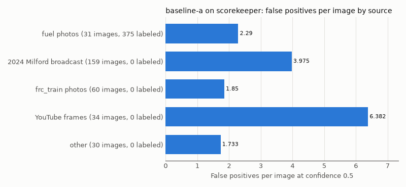
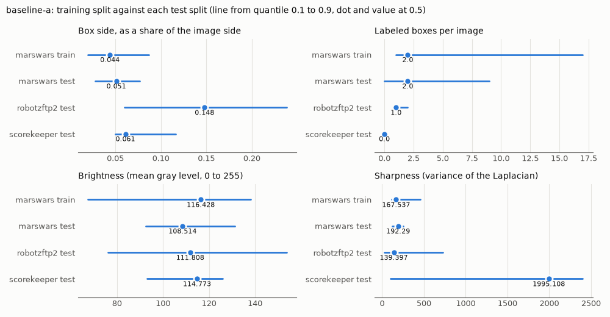
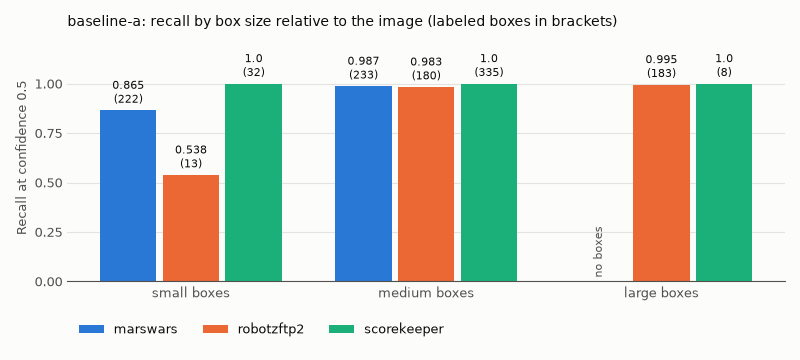
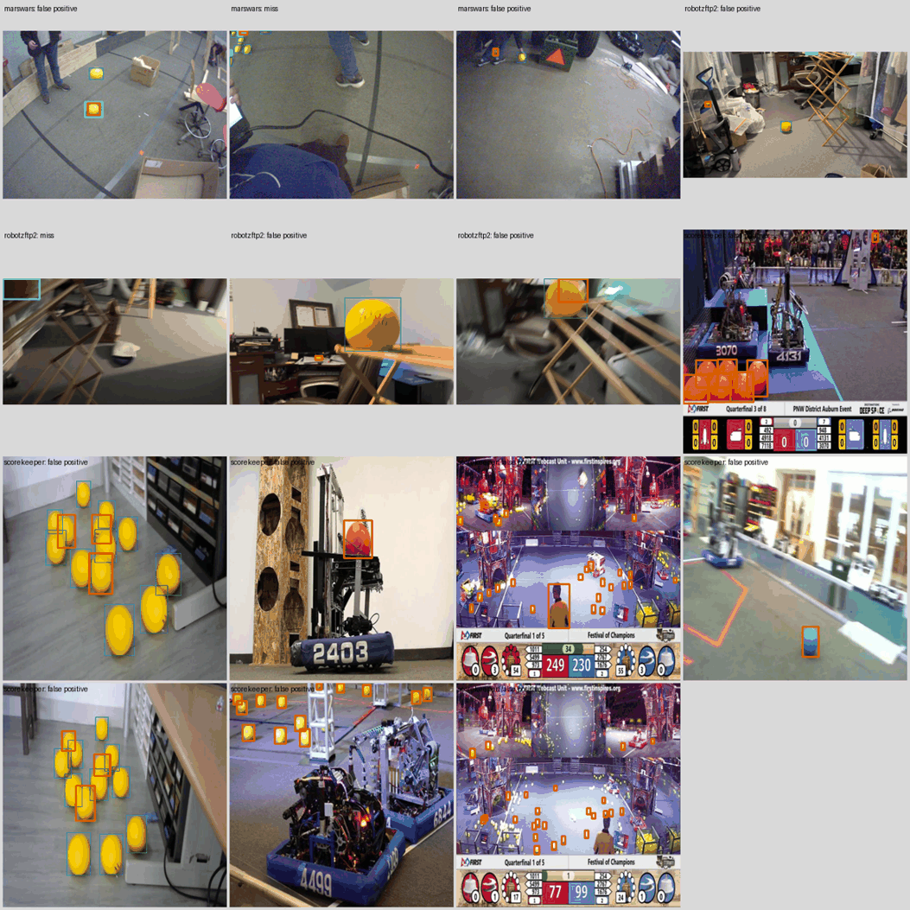

# Why a fuel detector sees fuel in the crowd

Draft for v0.1.0. It covers the first three steps of the project: training
a baseline, scoring it on other teams' data, and working out why it fails.
The fix and the Raspberry Pi deployment come in later releases. Every
number here comes from the tables that `make report` generates, and
`docs/EVALUATION.md` has them in full.

## The short version

A detector trained on one FRC team's footage of the 2026 game piece, fuel,
did as well on a second team's footage as on its own. On a third team's
dataset it found all 375 labeled balls but also drew 1083 boxes on things
that aren't fuel. Looking at a random 40 of those boxes, 30 were on people,
such as heads in a broadcast crowd and spectators in yellow or orange
shirts. Seven more were balls from earlier FRC games.

Most of the training frames show a school shop and hallway, so the model
had little chance to learn that a round yellow blob in the stands isn't
fuel. The second dataset scored well for a different reason. Its balls are
large, and most images hold just one.

## Why this question

Many FRC teams build a vision model for the game piece each season, and
Roboflow Universe has several public REBUILT datasets from different
teams. The obvious shortcut is to take one of them, train on it, and put
the model on the robot. The question here is how well a model trained on
one team's data holds up on footage it has never seen, and what breaks
when it doesn't.

## The setup

Five public REBUILT datasets were downloaded and inspected, and three were
chosen for their differences (D-011, and `docs/DATASETS.md` describes each
one).

- Dataset A, `marswars`, is shot from a fisheye camera mounted low on a
  robot, in a school shop and hallway. It is the only dataset with that
  view, which is where a detector would run, so the baseline is trained on
  it.
- Dataset B, `robotzftp2`, is a phone held at standing height, filming
  fuel on carpet in a cluttered home.
- Dataset C, `scorekeeper`, mixes indoor photos of fuel in tight clusters
  with pit photos and match broadcasts from earlier seasons. Those photos
  show robots and crowds but no fuel.

Each dataset names its classes differently, so every label was mapped to
one of two classes, fuel and robot, and anything else was dropped (D-012).
The datasets' own splits put neighboring video frames in both train and
test, so a model would be tested on near copies of its training images.
Each one was re-split. A and B are cut by frame order
within each recording, with a gap of dropped frames between train and test,
and C by groups of related photos (D-013).

The baseline, baseline-a, is RF-DETR Nano, a small detector from Roboflow,
trained on A's training split with Roboflow's hosted training. Images were
shrunk to 384x384, and training added no random flips, crops, or color
changes (D-016). A labels fuel only, so baseline-a finds fuel only, and it is
scored on fuel only everywhere (D-019).

## How detectors are scored

A detector draws boxes and gives each one a confidence between 0 and 1. A
box counts as a hit when it overlaps a labeled ball enough, meaning the
area they share is more than half the area they cover together.

- Precision is the share of the model's boxes that are hits. Low precision
  means it sees fuel that isn't there.
- Recall is the share of labeled balls that the model found. Low recall
  means it misses fuel.
- mAP50 sorts the boxes by confidence and measures how precise the model
  stays as it finds more of the labeled balls. It is 1 when every ball is
  found before any wrong box. The 50 refers to the overlap rule above.

Precision and recall below count boxes with a confidence of at least 0.5.
mAP50 uses each image's 25 most confident boxes, down to a confidence of
0.01.

Each test split comes from a handful of recordings, and frames from one
recording look alike. So each mAP50 comes with an interval, found by
drawing random sets of whole recordings, with repeats, many times and
scoring each set. A wide interval means the
score depends heavily on which recordings ended up in test.

## Results

| Dataset | Images | mAP50 | mAP50 interval | Precision | Recall | Wrong boxes |
|---|---|---|---|---|---|---|
| A, `marswars` (its own) | 171 | 0.936 | 0.923 to 1.0 | 0.963 | 0.927 | 16 |
| B, `robotzftp2` | 286 | 0.994 | 0.985 to 1.0 | 0.966 | 0.973 | 13 |
| C, `scorekeeper` | 314 | 0.836 | 0.773 to 0.895 | 0.257 | 1.0 | 1083 |

On A, its own dataset, the model does well, but that score is optimistic.
A's test split holds later frames of the same recordings it trained on.

B was expected to be harder, with a different camera, room, and lighting.
Instead it scores as well as A.

C drops. Its mAP50 interval doesn't overlap A's, so the drop is larger than
the choice of test photos would explain. Every labeled ball is found, so
the whole drop comes from wrong boxes. Counting only boxes with a confidence
of 0.8 or more helps only partway, with precision 0.724 and recall 0.981.

## Why it fails where it does

Every error was matched back to its image and grouped by source, box size,
crowding, brightness, and sharpness. Then errors were judged by eye, every
one on A and B and a random 40 on C (D-021).

### The wrong boxes on C come from photos without fuel



Of C's 1083 wrong boxes, 1012 fall on the 283 test images with no fuel
label, the pit photos and match broadcasts. One source, a 2024 broadcast
from Milford, gives 632 of them. Of the 40 checked by eye, 30 are people
and 7 are balls from earlier games. A head in a broadcast frame is about
the size of a ball, and a yellow or orange shirt is close to the color of
fuel.

The other 3 are real fuel that C's labels missed, each in a tight cluster
next to labeled balls. On C's 31 fuel photos, 60 of the 71 wrong boxes
touch a labeled ball but overlap it less than the half needed to count. C's clusters may be labeled less
completely than A's, which would make C's fuel photos score a little too
low. Three balls are too few to say how often it happens.

### B is easy because its balls are large and few



The median box side in B's test split is 0.148 of the image side, against
0.044 in A's training split. B's test split has one ball per image at the
median. A's training split has 2 at the median and 17 at the 90th
percentile. One large ball in
the middle of the frame is an easy case, so B scoring as well as A says
little about how close the two datasets are. Of B's 13 wrong boxes, 12 are
other yellow objects in the room, such as the cap of a vacuum cleaner.

### A's misses are balls cut off by the frame edge



On A, recall is 0.865 for small boxes and 0.987 for medium ones. That
looks like the model losing small balls when frames shrink to 384 pixels.
The review says otherwise. Of A's 33 misses, 24 are balls cut off by the
edge of the fisheye frame, whose labels are thin strips that count as
small boxes. The model boxes them differently or not at all. No miss is a
clearly visible ball that the model skipped. All 10 of B's misses are edge
balls too.

### The gallery



Fifteen of the errors, with labels in green, wrong boxes in orange, and
missed labels in light blue. The Milford broadcast is left out, because
every frame of it shows spectators close to the camera.

## What comes next

The largest error on other teams' data is fuel drawn on people and on
other games' balls. The merged model in v0.2.0 will train on images of
crowds, pits, and old game pieces with no fuel label, and the results
for each source will show whether that worked. It also needs a rule for how much of
an edge ball to label, applied to every dataset, and C's unlabeled clusters
fixed or left out before C is used for training. A held-back dataset, picked
after v0.1.0, kept out of all training, and scored only once, will check
the fix (D-022).

After that come a confidence threshold picked for the robot, where a
missed ball and a wasted pickup cost different things, and a Raspberry Pi
deployment with measured speed in v0.3.0.

## Limits

Nothing here shows how the model does in a real 2026 match. The project's
own field footage isn't confirmed yet. A's training split includes frames
from FIRST's official REBUILT game videos, but no test split holds footage
from a REBUILT field.

Each test split rests on a few recordings (6 for A and 7 for B), so the
intervals are wide. C's scores are bounds. Each image keeps its 25 most
confident boxes (D-020), which on C dropped only wrong boxes, so C's true
mAP50 is at most 0.836 and its wrong boxes at least 1083. The verdicts are
one person's first pass, and on C they cover 40 of 1083 boxes, so they
show which kinds of error are common, not their exact rates. The results
by source, size, and the rest have no intervals, and several rest on one
recording.

The model was trained on Roboflow's platform, which can't be repeated bit
for bit. Everything after training can be. The predictions are cached in
the repo, and every score, table, and figure is rebuilt from them.

## Reproducing it

The notebook `notebooks/reproduce_baseline.ipynb` runs on Colab. It
downloads and harmonizes the datasets, then rescores the committed
predictions and checks that the scores match. It needs a Roboflow API key
for the download only. On your own machine:

```bash
make setup
make download harmonize   # needs ROBOFLOW_API_KEY in .env
make report               # rebuilds the tables and figures from reports/
```

`docs/EVALUATION.md` explains how to score a model live, and
`docs/RETRAINING.md` how the baseline was trained. The datasets are
credited in the README.
